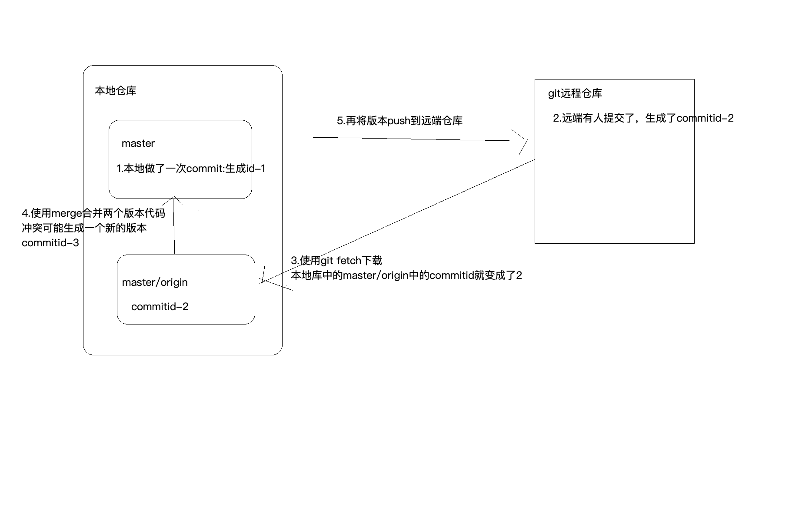
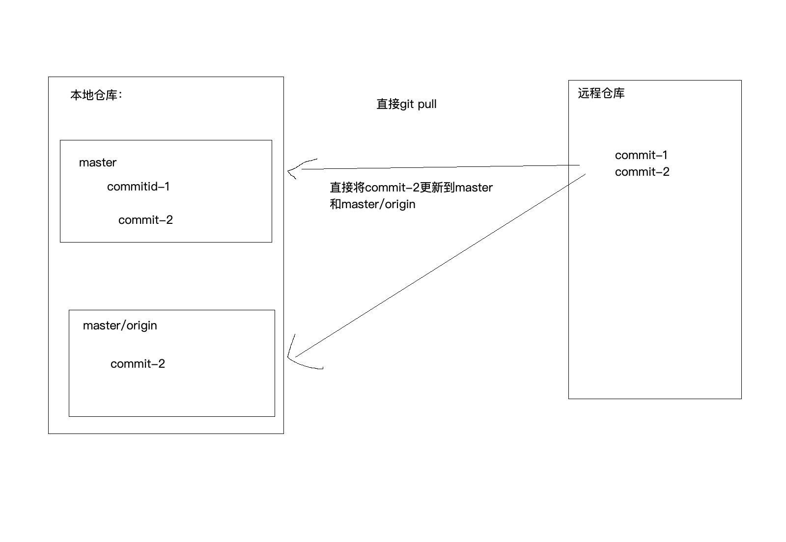
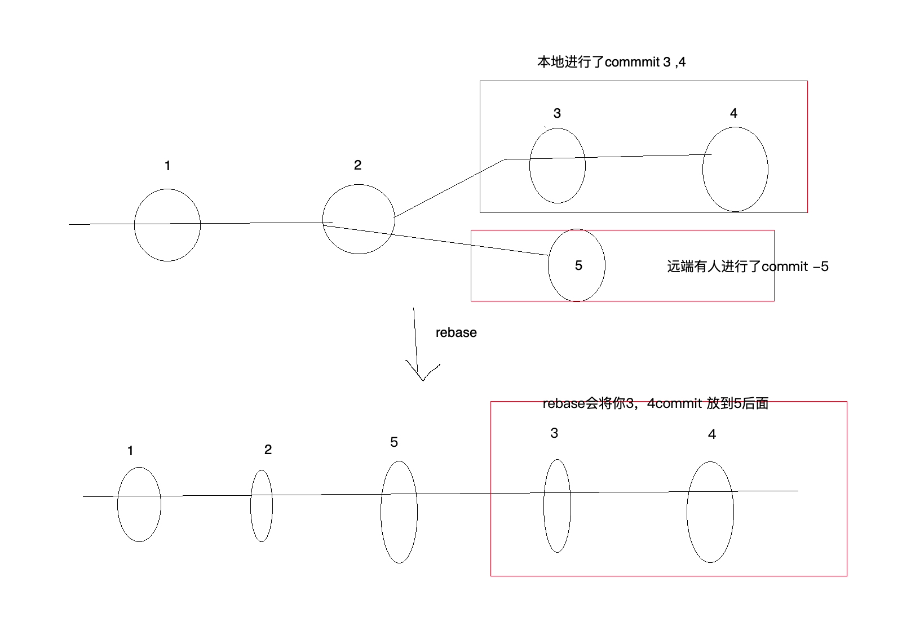
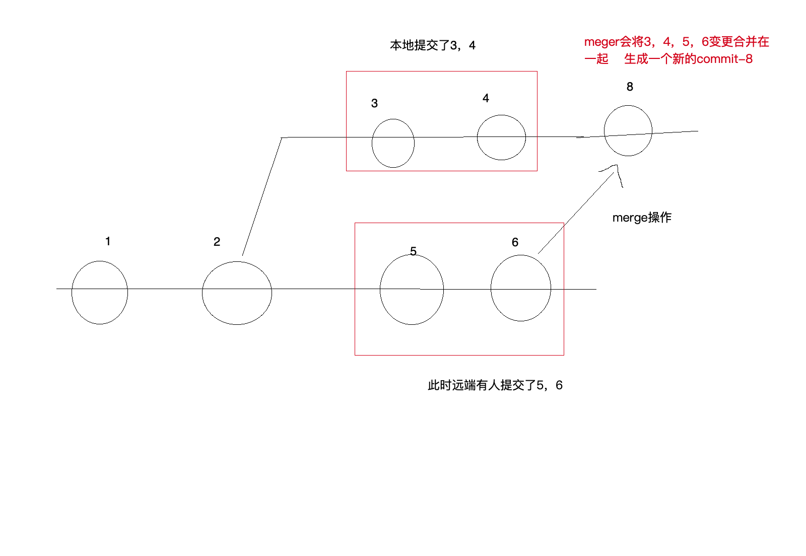

# git学习梳理

## 安装git

windows:[官网下载安装程序]( https://git-scm.com/downloads )，默认选项安装即可。

mac:AppStore安装Xcode即可。

安装完成后简单配置一下

```
git config --global user.email xuelin.common@gmail.com
git config --global user.name wenxl
```

## 配置SSH Key

```
ssh-keygen -t rsa -C "youremail@example.com"
```

key生成成功后用户主目录生成.ssh文件夹。

id_rsa是私钥，id_rsa.pub是公钥。

登录github，找到Settings=>SSH and GPG keys设置，

点击New SSH key，`Title`输入框随意，`Key`输入框填入公钥的内容

## 创建本地版本库

项目根目录下运行`git init`初始化git仓库

运行`git status`可以查看文件内容的增删改查

将内容添加到暂存区

`git add <file> `//指定文件 多个可以用空格隔开

 `git add *  `//将所有的内容添加到暂存区

`git add -u` //所有的改动文件添加到暂存区

将暂存区的内容，提交版本记录

`git commin -m <message>` 

## 本地仓库关联远程仓库

1. 现在github上建一个仓库

2. 将本地仓库管理远程仓库

   ```
   git remote add origin git@github.com:wenxuelin2521/learn-git.git
   git push -u origin master // 首次推送需要添加 -u 参数，此后提交可以直接
   git push origin master // 二次提交可以简写 master表示提交到远端的master分支上	
   ```

## 从远程仓库克隆

```
git clone -b master git@github.com:wenxuelin2521/learn-git.git learn-git

git clone -b branch url packageName

三个参数含义：
-b branch ： 指定分支
url       :  clone的url，可以是http 也可以是 ssh
packageName : 下载到本地的包名，不加的话默认使用远程仓库的报名
```


## 配置不用每次拉取、推送都输入账号密码
```
git config --global credential.helper store
```
## 使用git fetch拉取代码
```
git fetch
git rebase
解决冲突
git add 冲突文件
git rebase –continue
git push
```

### git fetch + git merge 和 git pull的区别
工作流程：添加到暂存区->commit到本地仓库，生成commitId->push到远程仓库，记录这个Id

- `git fetch` : 下载更新本地库中的[分支]/origin



- `git pull` : 会自动merge



所以其实`git fetch + git merge`和`git pull`从commitId来看的话是不一样的

### git rebase 和 git merge

- `git rebase` : 将你当前分支的的commit放到公共分支的最后面面,所以叫做**变基**



- `git merge` : 将公共分支和你当前的commit合并在一起，形成一个新commit进行提交



   + 注意：
   + 1. 不要在公共分支上使用`rebase`
   + 2. 本地和远端对应同一条分支的时候优先使用`rebase`，而不是`merge`

- `git rebase [--abort] | [--skip]  |  [--continue]`
git rebase --abort 会放弃合并，回到rebase操作之前的状态，之前的提交的不会丢弃；
git rebase --skip 则会将引起冲突的commits丢弃掉（慎用！！）；
git rebase --continue 合并冲突，结合"git add 文件"命令一起用与修复冲突。

## 版本管理

  

```
git status //查看文件状态：新增，修改，删除
git log --oneline -10 //查看版本提交的日志，获取版本号 -10表示最新十条
git reset --hard 版本号 //再知道版本号后，可以回退到指定版本
//其他写法
git reset --hard HEAD^  //回退到上一个版本 
git reset --hard HEAD^^ //回退到上上一个版本
如此类推

git reflog --oneline -10  //查看命令历史，可以用于穿梭未来 -10表示最新十条
```

丢弃工作区的内容：

```
git checkout -- file
```

回退暂存区的内容，回退的内容回到暂存区

```
git reset HEAD file
```

已经提交了版本，需要回退版本

```
git reset --hard 版本号
```

不在跟踪某个文件，但是依然保留文件
```
git rm --cached fileName
```
不在跟踪某个文件，并且删除文件
```
git rm -f fileName
```

## 分支管理

```
//创建develop分支，并且切换到develop上
git checkout -b develop   相当于 git branch develop (创建); git checkout develop（切换）；

//查看分支，*号表示当前分支
git branch

//切换回maseter
git checkout master

//合并分支(将develop上的改动合并到当前分支上)
git merge <branchName> //合并分支产生冲突，需要手动解决后再执行 add 和 commit 操作才可以
//默认合并会使用fast forward模式，该模式下删除分支后就会丢掉分支信息
//可以强制禁用fast forwadr模式，那么merge时候就会生成一个新的commit信息
git merge --no-ff -m "<commit message>" <branchName>

//删除分支
git branch -d develop //非强行删除
git branch -D develop //强行删除

//最新版本的git提供switch关键字来切换
git switch -c dev //创建并且切换到dev分支上

//本地分支与远端分支关联
git branch --set-upstream-to=origin/<branchName> <branchName>

//本地创建分支的同时管理到远端的分支
git checkout -b <branchName> origin/<branchName>

// 把本地分支推送到远端
git push origin <branchName>

// clone仓库后，一次性同步所有分支的代码到本地
git clone "git地址"
cd 仓库
git branch -r | grep -v '\->' | while read remote; do git branch --track "${remote#origin/}" "$remote"; done
git fetch --all 将本地所有分支与远程保持同步
git pull --all 最后拉取所有分支代码
```

bug分支 （我的理解是一个草稿功能）

```
git stash //存储当前未完成工作
git stash list //查看临时存储的内容
git stash pop //恢复案发现场，并且删除草稿
git stash apply [stash@{number}] // 应用某个存储，但不删除
git stash drop [stash@{number}]// 丢弃草稿内容
git stash clear // 删除所有的草稿
```

## 标签管理

```
//创建标签-默认最新提交的commit
git tag <name>

//创建到指定的版本上
git tag <name> 版本号

//查看所有的标签
git tag

//增加说明
git tag -a 标签名 -m "标签说明" 版本号

//删除本地标签
git tag -d <tagname>

//推送一个本地标签
git push origin <tagname>

//推送全部未推送过的本地标签
git push origin --tags

//删除一个远程标签(需要先删除本地)
git push origin :refs/tags/<tagname>
```


注：本文是学习廖雪峰老师[《git教程》](https://www.liaoxuefeng.com/wiki/896043488029600)后的个人总结

