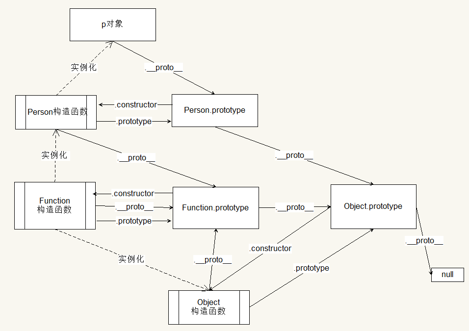

# 1、浏览器内核：

**IE**:trident;

**FireFox**:gecko;

**Chrome**:Blink;

**Safari**:webkit;


# 2、盒子模型

盒子模型的基本属性：content + padding + border + margin 

css盒子模型有两种：

IE盒子模型（怪异盒子）:width = content + padding + border

W3C标准盒子模型：width = content


# 3、BFC 规范理解块格式化上下文（block formatting context）

特性(功能)：

（1）内部的box会在垂直方向上一个接一个的放置

（2）垂直方向上的距离由margin决定

（3）bfc的区域不会与float的元素区域重叠

（4）计算bfc的高度的时，浮动元素也参与计算

（5）bfc就是页面上一个独立容器，里面的子元素不会影响外面的元素


触发：

（1）float：除了none以外的值

（2）overflow：除了visible以外的值（hidden,auto,scroll）

（3）display：table-cell,table-caption,iline-block,flex,inline-flex

（4）position：absolute,fixed,fieldset

（5）fieldset元素


可以解决的问题

（1）margin叠加问题（塌陷现象）

（2）左右布局元素

（3）清除浮动


可以参考：https://www.cnblogs.com/chen-cong/p/7862832.html


# 4、MVC和MVVM

mvc和mvvm都是一种设计思想。

mvc模式的意思就是软件可以分成三部分：视图view（用户界面）、控制器controller（业务逻辑）、模型model（数据保存）

通信方式如下：（所有通信都是单向的）


1、view传送指令到controller

2、controller完成业务逻辑之后，要求model改变状态

3、model将新数据发动到view，用户得到反馈


mvvm模式就是view 、viewModel、model


1、view与model不发生联系，都是通过viewmodel

2、view层不做业务逻辑，所有的逻辑都在viewmodel层

3、mvvm采用双向绑定：view的变动，自动反应在viewmodel上，反之亦然


# 5、原型和原型链

函数原型链：


完整的原型链



# 6、异步async/await promise

```javascript
async function async1 () {
    console.log('async1 start');
    await async2();
    console.log('async1 end');
}

async function async2 () {
    console.log('async2');
}

console.log('script start');

setTimeout(function () {
    console.log('setTimeout');
}, 0);

async1();

new Promise(function (resolve) {
    console.log('promise1');
    resolve();
}).then(function () {
    console.log('promise2');
});

console.log('script end');
```

答案：

1、script start	2、async1 start	3、async2	4、promise1	5、script end	6、async1 end	7、promise2

8、setTimeout

解析，会有一个队列的概念，遇到异步将他塞进队列，先执行下面的同步代码，做完同步代码后再进行队列里面的任务，先进队列的先做


# 7、vue双向绑定的原理

（1）Object.keys(obj)方法：用于获取对象自身所有的属性，返回一个由属性名组成的数组。

（2）Object.definedProperty(obj,prop,descriptor)方法：定义对象中新属性或修改原有的属性。

​			参数说明：obj-目标对象，prop-需要定义或修改的属性名字，descriptor-目标属性所拥有的特性。

​			第三个参数descriptor说明：以对象形式{}书写

​			value:属性的值，默认undefined。

​			writable:值是否可以重写，true|false，默认为false。

​			enumerable:目标属性是否可以被枚举，true|false，默认为false。	

​			configurable:目标属性是否可以被删除或是否可以再次修改特性，true|false，默认为false

原理：

​			Object.definedProperty对当前对象已经存在的属性进行的劫持，设置get,set方法，不存在的属性不会触发get,set方法，但属性确实会添加到原有的对象里。

```javascript

function defineReactive(obj, key, value) {
    Object.defineProperty(obj, key, {
        enumerable: true, // 可枚举
        configurable: true, // 可配置的
        get: function() {
            console.log('===========触发get===========');
            return value;
        },
        set: function(newValue) {
            console.log('===========触发set===========');
            value= newValue;
        }
    });
}

var person = {name: '张三', say: '我是路人甲', run: '我会跑步'};

function Observer(value) {
    const keys = Object.keys(value)
    keys.forEach(k => {
        defineReactive(value, k, value[k]);
    });
}
Observer(person)
console.log(person.run)
person.say = '我是路人乙';
person.eat = '我要吃饭';  // 没有任何输出

//运行结果：
// ===========触发get===========
// 我会跑步
// ===========触发set===========
```

对数组进行劫持

```javascript
var arr = ['one', 'two', 'three']
Observer(arr)
console.log(arr[0])
arr[1] = '2';
arr[3] = '4';  // 没有触发set方法
console.dir(arr)

//运行结果
// ===========触发get===========
// one
// ===========触发set===========
// [ [Getter/Setter], [Getter/Setter], [Getter/Setter], '4' ]
```


由于性能问题、性能代价和获得的用户体验收益不成正比，所以vue还要提供Vue.set()方法。所以引出proxy。proxy概述：在目标对象外面搭建一层拦截，外界对目标对象的某些操作，必须通过这层拦截。

（3）vue3.0用proxy替代Object.definedProperty()

proxy的demo

```javascript
let target = {
    get(obj, key, receiver) {
      console.log('===========触发get===========');
      return Reflect.get(obj, key, receiver);
    },
    set(obj, key, value, receiver) {
      console.log('===========触发set===========');
      obj[key] = value;
      return Reflect.set(obj, key, value, receiver);
    },
  }
  
  var person = {name: '张三', say: '我是路人甲', run: '我会跑步'};
  
  let newObj = new Proxy(person, target);
  console.log(newObj.run)
  newObj.say = '我是路人乙';
  newObj.eat = '我要吃饭';
  console.dir(person)
  
  var arr = ['one', 'two', 'three']
  let otherObj = new Proxy(arr, target);
  console.log(otherObj[0])
  otherObj[1] = 'new-two';
  otherObj[3] = '4';
  console.dir(arr)

//运行结果
// ===========触发get===========
// 我会跑步
// ===========触发set===========
// ===========触发set===========
// { name: '张三', say: '我是路人乙', run: '我会跑步', eat: '我要吃饭' }
// ===========触发get===========
// one
// ===========触发set===========
// ===========触发set===========
// [ 'one', 'new-two', 'three', '4' ]
```

从demo中可以看到，Proxy 可以弥补Object.defineProperty缺失的功能


# 8、数组常用的api

（1）arr.concat(arr1,arr2...)**//返回一个新的拼接数组**

（2）join(separator)/**/用分割符分割每一个元素，返回一个字符串**

（3）slice(start,end)**//截取源数组，从下表start到end，不包括end**

（4）splice()方法：插入，删除，替换 **//返回删除/替换掉的数组，源数组根据操作改变**

（5）indexof(element)**//返回找到元素的下标，没有找到返回-1**

（6）pop()、push()、shift()、unshift()**push和unshift返回插入数组后数组长度，pop和shift返回数组移除的元素。源数组会改变**

（7）reverse()**数组倒转，返回翻转数组**

（8）sort(sortby)**排序，根据sortby回调去排，也可以不传**

```javascript
let arr = [1,2,'s',3,4,5]

// concat
let arr1 = arr.concat([6,7])
console.log(arr1);

//join
let res = arr.join('@')
console.log(res);

// slice
let res = arr.slice(1,3)
console.log(res,arr);

//splice
let res = arr.splice(1,1)//删除（start,delnum）
console.log(res,arr);

let res = arr.splice(1,2,'r','s')//替换（start,替换个数，用什么替换）
console.log(res,arr);

let res = arr.splice(1,0,'q','w','e')//新增（start , 0 , 替换元素）
console.log(res,arr);

//indexof
console.log(arr.indexOf('r'))

//push pop shift unshift
let res1 = arr.push('q')
console.log(res1,arr);

let res2 = arr.pop()
console.log(res2,arr);

let res3 = arr.shift()
console.log(res3,arr);

let res4 = arr.unshift(['q','d','s'])
console.log(res4,arr);

//reverse
let res = arr.reverse()
console.log(res,arr,arr===res);

//sort
arr = [2,1,4,69,33,13,20,78,0]
let res = arr.sort((a,b) => {return b - a})
console.log(res , arr , res === arr);
```


其他：

（9）lastIndexof **//反向查找元素，返回其下标**

（10）forEach **遍历数组，参数是一个回调，回调的三个参数:element,index,array**

（11）map **对原数组做一些操作返回新的数组（映射），原数组不变。参数是一个回调**

（12）every、some **every判断数组中的每一个元素是否符合定义的规则。some判断数组中是否有值符合定义的规则。返回值都是boolean值**

（13）filter **返回数组的子集，按照规则过滤，源数组不变**

（14）reduce **将数组元素值合成一个返回**


# 9、如何判断vue里面的数据失去双向绑定

根据v-model中的值是否有 **get**和 **set**两个方法

验证demo

```vue
<template>
  <div id="app">
    <ul>
      <li v-for="(item,i) in arr" :key="i">
        <input type="text" v-model="item.name">
      </li>
    </ul>
    <a href="javascript:void(0);" @click="func()">点击输出</a>
    <br>
    <a href="javascript:void(0);" @click="add()">点击添加</a>
    <br>
    <a href="javascript:void(0);" @click="push()">点击push</a>
  </div>
</template>

<script>

export default {
  name: 'app',
  data(){
    return {
      arr :[
        {name:'11'},
        {name:'22'},
        {name:'33'}
      ]
    }
  },
  methods: {
    func(){
      console.dir(this.arr);
    },
    add(){
      this.arr[3] = {name:'44'}
    },
    push(){
      this.arr.push({name:'rr'})
    }
  },
}
</script>
```


# 10、vue中的插槽slot的用法

定义：插槽，也就是slot，是组件的一块HTML模板，这块模板显不显示，以及怎么显示由父组件来决定。

1、单个插槽（默认插槽|匿名插槽）用法

```vue
//父组件
<template>
    <div class="father">
        <p>这个是父组件</p>
        <son>
            <h1>这个标题会插入到子组件的插槽位中</h1>
            <p>这个正文也会插入到子组件的插槽位中</p>
        </son>
    </div>
</template>


<script>
import son from './son.vue'
export default {
    components:{son}
}
</script>

//子组件
<template>
    <div class="children">
        <p>这个是子组件</p>
        <slot></slot>
    </div>
</template>
```

2、具名插槽：**插槽加了name属性，就变成了具名插槽。具名插槽可以在一个组件中出现N次，出现在不同的位置。**

```vue
//父组件
<template>
    <div class="father">
        <p>这个是父组件</p>
        <son>
            <div class="box1" slot="star">
                具名插槽-star
            </div>
            <div class="tree" slot="tree">
                具名插槽-tree
            </div>
        </son>
    </div>
</template>


<script>
import son from './son.vue'
export default {
    components:{son}
}
</script>

//子组件
<template>
  <div class="children">
    <slot name="star"></slot>
    <slot name="star"></slot>
    <slot name="star"></slot>
    <p>这个是子组件</p>
    <slot name="tree"></slot>
    <slot></slot>
  </div>
</template>
```


3、作用域插槽（带数据的插槽）

```vue
//父组件
<template>
    <div class="father">
        <p>这个是父组件</p>
        <son>
            <!-- 这里拿到的dataA是子组件中传过来的数据合成的一个对象 -->
          	<!-- 这个例子中的dataA的值是
			{ "arr": [ 12, 13, 14, 15, 16, 17, 18, 19, 20 ], "obj": { "age": 18, "name": "xm" } }
						-->
            <template slot-scope="dataA" slot="note">
                <ul>
                    <li v-for="(item , i) in dataA.arr" :key="i">{{item}}</li>
                </ul>
                {{dataA}}
            </template>
        </son>
    </div>
</template>


<script>
import son from './son.vue'
export default {
    components:{son},
}
</script>

//子组件
<template>
  <div class="children">
    <slot name="note" :arr="arr" :obj="obj"></slot>
  </div>
</template>

<script>
export default {
    data(){
        return {
            arr:[
                12,13,14,15,16,17,18,19,20
            ],
            obj:{
                age:18,
                name:'xm'
            }
        }
    }
}
</script>
```


# 11、v-for中key的作用

- 需要使用 key 来给每个节点做一个唯一标识，Diff 算法就可以正确的识别此节点，找到正确的位置区插入新的节点
所以一句话，key 的作用主要是为了高效的更新虚拟 DOM

- 除了v-for的时候使用到key，还有如果通过v-if/v-else-if/v-else指令去渲染相同结构的内容的时候，也是需要添加key值


# 12、vue中常用的指令

v-model	v-for	v-show	v-if	v-bind	v-on	v-text	v-html	v-cloak	......


# 13、vue-router的钩子

主要作用是用来拦截导航，让他完成跳转或者取消

三种方式：

1、全局导航钩子

```javascript
//注册一个全局前置守卫
const router = new VueRouter({...})
router.beforeEach((to,from,next) => {
	//do something
})
//全局后置钩子
router.afterEach((to,from) => {
  //do something
})
```

2、路由独享的钩子

```javascript
const router = new VueRouter({
  routes:[
    {
      path:'/foo',
      component:Foo,
      beforeEnter:(to,from,next) => {
        //do something
      }
    }
  ]
})
```

3、组件内的导航钩子

```javascript
//beforeRouteEnter、beforeRouteUpdate、beforeRouteLeave
const Foo = {
  template:`...`,
  beforeRouteEnter(to,form,next){
    // 在渲染该组件的对应路由被 confirm 前调用
    // 不！能！获取组件实例 `this`
    // 因为当守卫执行前，组件实例还没被创建
  },
  beforeRouteUpdate(to,form,next){
    // 在当前路由改变，但是该组件被复用时调用
    // 举例来说，对于一个带有动态参数的路径 /foo/:id，在 /foo/1 和 /foo/2 之间跳转的时候，
    // 由于会渲染同样的 Foo 组件，因此组件实例会被复用。而这个钩子就会在这个情况下被调用。
    // 可以访问组件实例 `this`
  },
  beforeRouteLeave(to,form,next){
    // 导航离开该组件的对应路由时调用
    // 可以访问组件实例 `this`
  }
}
```


# 14、vue的钩子

共8个阶段：创建前后、载入前后、更新前后、删除前后

beforeCreated、created、beforeMount、mounted、beforeUpdate、updated、beforeDestory、destoryed


# 15、vue中组件通讯的方式有几种

自己常用的三种：

1、父传子props/$emit

2、子组件中的暴露方法操作数据，父组件使用$ref调用

3、vuex

官方有六种：[网上总结链接](https://github.com/ljianshu/Blog/issues/66)


# 16、$nextTick(() => {})

将回调函数延迟在下一次dom更新数据后调用。理解：当数据更新了，在dom中渲染后，才自动执行该函数。


# 17、自定义组件

vue注册全局组件的三种方法：

1. 方法一：Vue.extend()配合Vue.component()使用
2. 方法二：Vue.component('组件名','配置对象')创建
3. 方法三：Vue.component(组件名，'配置对象的id'),配置对象写在独立的script标签或者template标签中


定义私有组件：

使用components属性


如果想把自己的组件封装成一个库，让别人通过use来使用的话，需要配合**install**来使用

```javascript
//index.js
import Icon from './components/icon';
import Button from './components/button';

import alert from './components/alert';

const components = {
  Icon,
  Button
}
const $alert = alert.show;

function install (Vue) {
  //组件调用
  Object.keys(components).forEach(key => {
    Vue.component(key, components[key]);
  });
  //方法调用
  Object.assign(Vue.prototype, {
    $alert
  });
}

export default {
  install,
};

export {
  $alert
};

//其他地方使用
import xxx from 'path/index.js'
Vue.use(xxx)
```


# 18、vue中的虚拟dom：

https://github.com/zhengjiaqing/blog/issues/11


# 19、vue-router中的hash模式和history模式

vue-router需要满足两个需求：

- 记录当前页面状态
- 可以使用浏览器的前进后退功能

为了满足上面两个需求实现了一下三个功能

1. 改变url且不让浏览器向服务器发送请求。
2. 检测url的改变
3. 截获url地址，并解析出需要的信息来匹配路由规则


**hash模式：（html5之前）**

hash表示地址栏url中的**#**符号，hash会出现在url中但是不会被包含在http请求中，因此改变hash值不会重新加载页面。

hash值改变会触发hashchange事件，浏览器的前进后退也能对其控制。所以在html5之前，基本都是使用hash值来实现前端路由。


**history模式：**

利用html5新增的两个api：pushState()和replaceState()。通过这两个api完成url跳转不会重新加载页面，同时history模式解决了hash模式存在的问题，hash的传参是基于url的，如果要传递复杂的数据，会有体积限制，而history模式不仅可以在url上传参，也可以将数据存放到一个特定的对象中。


总结参考：https://github.com/noobalex/lanbitou/issues/12


# 20、描述浏览器中输入url到页面渲染这个过程

1、浏览器开启一个线程来处理这个请求。同时在远程dns服务器上启动dns查询，获取对应请求的ip地址。

2、浏览器与服务器通过tcp三次握手协议来建立一个tcp/ip连接。

3、tcp/ip连接建立后，浏览器向服务器发送http请求，远程服务器找到资源然后通过http响应返回资源。

4、客户端开始下载资源。


# 21、跨域问题处理

同源策略：协议、端口、域名相同。同一段脚本只能读取来自同一源的窗口和文档属性。

1、jsonp:通过动态创建script标签，标签中的src属性获取js文件中的js脚本，脚本的内容是函数调用，参数就是服务器返回的数据。为了处理这些数据现在页面定义好回调函数，本质使用的并不是ajax。

2、response中添加header，允许跨域。（`Access-Control-Allow-Orighin`）

3、http服务器

4、nginx做反向代理。


# 22、页面优化

减少http请求

减少dns查找

避免重定向

使用ajax缓存

组件懒加载

代码压缩合并

不要出现http 404错误


# 23、字符串对象常用的api

1、chartAt() **返回指定位置的字符串**

2、indexOf() **查找某个字符串/字符的索引**

3、replace() **用某些字符替换字符串的某些字符**

4、slice() subStr() subString() **提取字符串的某些字符**

5、trim() **去空**

6、split() **把字符串分割成数组**


# 24、使用css阻止事件冒泡

js中的方法：

- event.preventDefault() 阻止默认动作
- event.stopPropagation() 停止事件传播，阻止冒泡


css：

- pointer-events:none;
  - 阻止用户点击动作产生任何效果
  - 阻止缺省鼠标指针的显示
  - 阻止css中的hover和active状态的变化触发事件
  - 阻止js点击动作触发的事件

```css
//demo
.disable{
		pointer-events:none;
		cursor:default;
		opacity:0.6;
}
```


# 25、js实现给图片添加水印

利用canvas:

```html
<!DOCTYPE html>
<html lang="en">

<head>
    <meta charset="UTF-8">
    <meta name="viewport" content="width=device-width, initial-scale=1.0">
    <meta http-equiv="X-UA-Compatible" content="ie=edge">
    <title>Document</title>
</head>

<body>
    <div>js实现给图片添加水印</div>
    <!-- canvas有默认的宽高：300 * 150 -->
    <canvas id="c1"></canvas>
    <input type="text" value="" id="text">
    <a href="javascript:void(0);" id="btn">添加水印</a>
</body>

</html>

<script>
    function shuiyin(canvasId, imgUrl, text) {
        var img = new Image();
        img.src = imgUrl;
        img.onload = () => {
            var canvas = document.getElementById(canvasId);
            var ctx = canvas.getContext('2d');
            ctx.drawImage(img, 0, 0);
            ctx.font = "20px 微软雅黑";
            ctx.fillStyle = "rgb(255,0,0)";
            document.getElementById('btn').onclick = () => {
                var addtext = document.getElementById("text").value;
                ctx.fillText(addtext, 10, 50);
            }
            if(text){
                ctx.fillText(text,10,50)
            }
        }
    }
    shuiyin('c1', './img/t1.jpeg', '777')
</script>
```


# 26、canvas导出图片的方法

使用 `toDataUrl()` 传入mine类型的参数，你还可以将画布转变成其它格式的图片。//接收mine类型参数，转成格式。

```javascript
//从 canvas 提取图片 image  
function convertCanvasToImage(canvas) {  
    //新Image对象，可以理解为DOM  
    var image = new Image();  
    // canvas.toDataURL 返回的是一串Base64编码的URL
    // 指定格式 PNG  
    image.src = canvas.toDataURL("image/png");  
    return image;  
} 
```


# 27、如何判断数据是不是数组

- instanceof：`[] instanceof Array 返回true`
- Array.prototype.isPrototypeOf(obj)：`Array.prototype.isPrototypeOf([])返回true`
- Array.isArray()方法()：`Array.isArray([1,2,3])返回true`