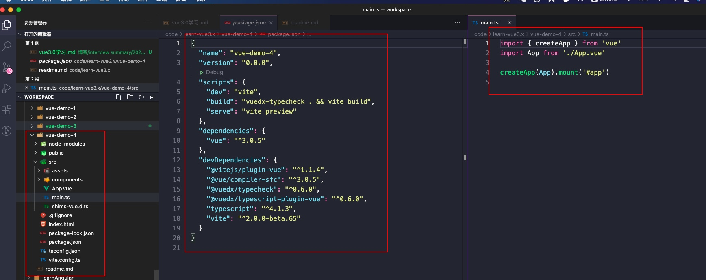

# vue3.0简单使用学习

## 参考文章
- [官方文档](https://v3.vuejs.org/)
- [中文文档](https://v3.cn.vuejs.org/)
- [Vue 3.0 源码开放，看看都有哪些新特性](https://zhuanlan.zhihu.com/p/85343099)
- [Vue 3 源码导读](https://juejin.im/post/5d977f47e51d4578453274b3)
- [Vue Function-based API RFC](https://zhuanlan.zhihu.com/p/68477600)

## 新特性简单总结
1. 全面使用Typescript
2. 响应式原理从`Object.defineProperty`变成了`Proxy`
3. 引入了`hooks`，参照react16.8新特性


## 项目构建
**备注：编写文档的时候，使用的脚手架版本为：@vue/cli 4.5.11**

方式1：无论是2.x项目还是3.0的项目，都可以通过使用`@vue/cli`脚手架来构建
方式2：使用[vite](https://vitejs.dev/)（还没看QAQ，加油）

### vue2.x项目转换成3.x的方式
方式1：通过补丁的形式[@vue/composition-api](https://github.com/vuejs/composition-api)

1. 使用命令`vue create vue-demo-1`构建一个2.x的项目，构建时候的选项，这里就不在描述，按需选择。
2. 安装包`npm install @vue/composition-api`
3. 在入口文件`main.js`中，引入`VueCompositionAPI`，通过`Vue.use()`注册一下
4. 使用API


方式2：通过`vue add vue-next`完完全全使用vue3.x生态（vue\vue-router\vuex）都是最新的
1. 使用命令`vue create vue-demo-1`构建一个2.x的项目，构建时候的选项，这里就不在描述，按需选择。
2. 使用命令`vue add vue-next`修改项目
3. 使用API

- 运行前：项目目录和package.json截图


- 运行后：项目目录和package.json截图


- API简单使用


### 使用脚手架直接创建3.x项目
1. 使用命令`vue create vue-demo-3`构建一个3.x的项目。


### 使用vite
```sh
$ npm init @vitejs/app <project-name>
$ cd <project-name>
$ npm install
$ npm run dev
```




## 语法差异

1. `template`几乎无差别
2. `style`几乎无差别
3. `script`区别：
(1) 使用了`setup`函数：`setup`函数在vue3.x中是一个非常重要的函数，它的执行时机是`beforeCreate`之后和`created`之前，很多代码都必须写在这个函数中，并且如果要在template中使用，那么就必须在`setup`中return出去。
(2) data
```js
// vue2.x中
data(){
    return {
        //...
    }
}

// vue3.x中
import { reactive , toRefs } from "vue";
setup() {
  const state = reactive({
    msg1:'hello',
    msg2:'world'
  })

  return{
    ...toRefs(state)
  }
}

```

(3) methods
```js
// vue2.x中
methods:{
    // 方法
}
// vue3.x中
setup() {
  const state = reactive({
    currentTime:new Date().getTime()
  })
  const editTime = ()=>{
    console.log('editTime')
    state.currentTime = new Date().getTime()
  }
  return{
    ...toRefs(state),
    editTime
  }
}
```

(4) computed
```js
// 从vue中引入computed
import { reactive , toRefs  , computed } from "vue";
// 第一种使用方式：直接写在setup函数上
setup(){
    const state = reactive({
        count:0
    })
    const sum = computed(() => { return state.count * 2})
    return {
        ...toRefs(state),
        sum
    }
}

// 第二种使用方式：写在state中
setup(){
    const state = reactive({
        count:0,
        sum : computed(() => { return state.count * 2})
    })
    return {
        ...toRefs(state),
    }
}

```

(5) 生命周期
与2.x对比主要是在前面加了on：onMounted、onBeforeUnmount...
```js
// 从vue中引入
import {onMounted} from "vue"

// 写在setup函数中
export default {
    setup(){
        onMounted(() => {
            console.log('onMounted')
        })
    }
}
```
(6) 组件传值
使用`provide`和`inject`，都要写在setup函数中
```js
// 父子组件分别引入provide和inject
import { provide , inject } from 'vue'

// 父组件传值
setup(){
    provide(key , value)
}

// 子组件接收
setup(){
    const keyName = inject(key , default)
    const state = reactive({
        keyName
    })
    return {
        ...toRefs(state)
    }
}
```


(7) 路由
- 路由配置
```js
// 从`vue-router`包中按需导入createRouter , createWebHashHistory等方法
// 通过routes配置路由链接
// 最后导出

import { createRouter , createWebHashHistory} from 'vue-router'

const router = createRouter({
  history: createWebHashHistory(),
  routes:[
    {path:"/" , name:"Home" , component:() => import('@/views/Home.vue')},
    {path:"/about" , name:"About" , component:()=>import("@/views/About.vue")}
  ]
})

export default router

```

- 编程式导航
```js
import { useRouter } from "vue-router"
export default {
    setup(){
        const router = useRouter()
        const go = () => {
            router.push({
                path:'/about',
                query:{
                    id:123
                }
            })
        }
        return {
            go
        }
    }
}
```

- 路由参数获取
```js
import {useRoute} from "vue-router"
export default {
  name: "about",
  setup(){
    const route = useRoute()
    onMounted(() => {
      console.log(route.query)
    })
  }
};
```

(8) vuex

- 配置
从vuex中导入createStore
通过createStore进行配置
导出createStore函数的返回

```js
import { createStore } from 'vuex'

export default createStore({
  state: {
    count:10
  },
  getters:{
    total(state){
      return state.count *2
    }
  },
  mutations: {
    SET_COUNT(state , value){
      state.count = value
    }
  },
  actions: {
  },
  modules: {
  }
})

```

- 使用
```js
import {useStore} from "vuex"

export default {
    setup(){
        const sotre = useStore()
        const changeCount = () => {
            store.commit('SET_COUNT' , store.state.count+1)
            console.log(store.state.count , store.getters.total)
        }

        return {
            changeCount
        }
    }
}
```

4. 其他：
(1) setup函数式vue3.x中非常重要的一部分
(2) vue2.x和3.x的语法可以共存
(4) 很多之前直接写在export default中的内容，现在大部分都要写在setup函数中
(5) 很多用到的内容比如：reactive、toRefs、computed、onMounted都需要从vue包中导入


## 完成小案例
使用豆瓣的api，完成豆瓣电影的几个页面

1. 首页
2. 列表页
3. 详情页