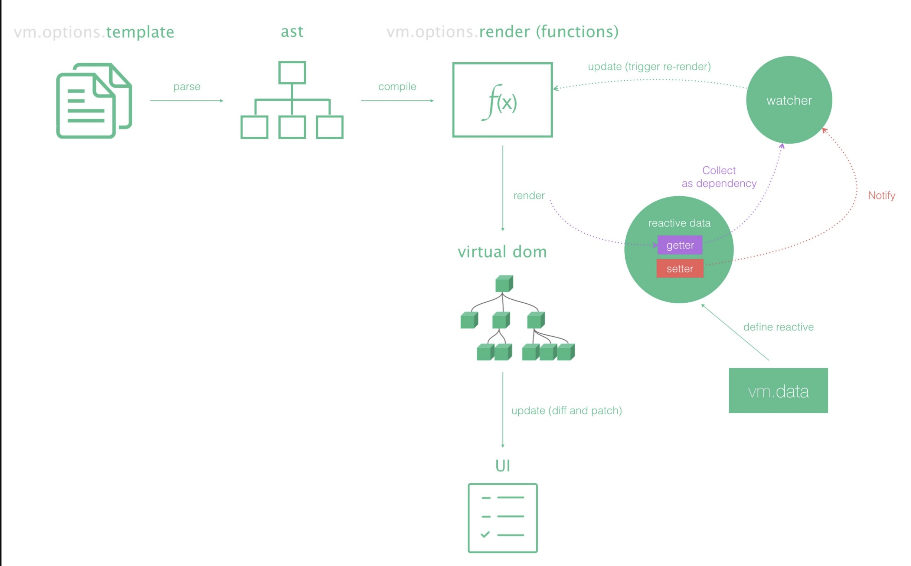
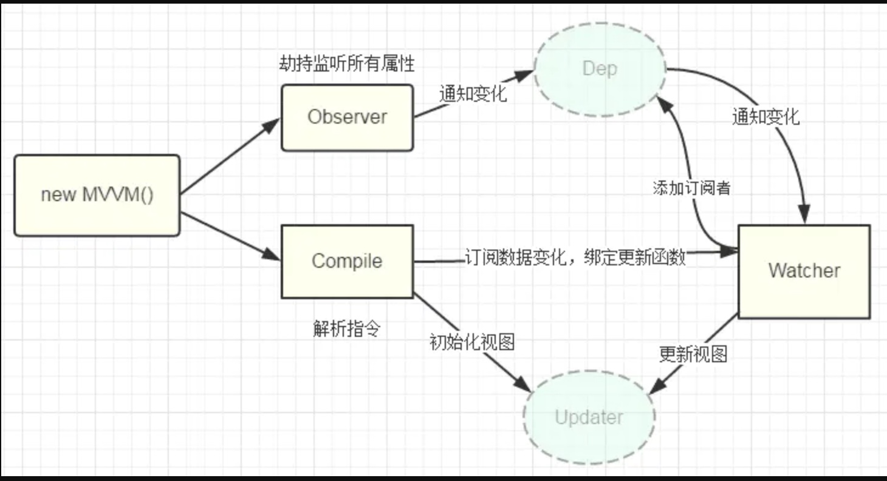
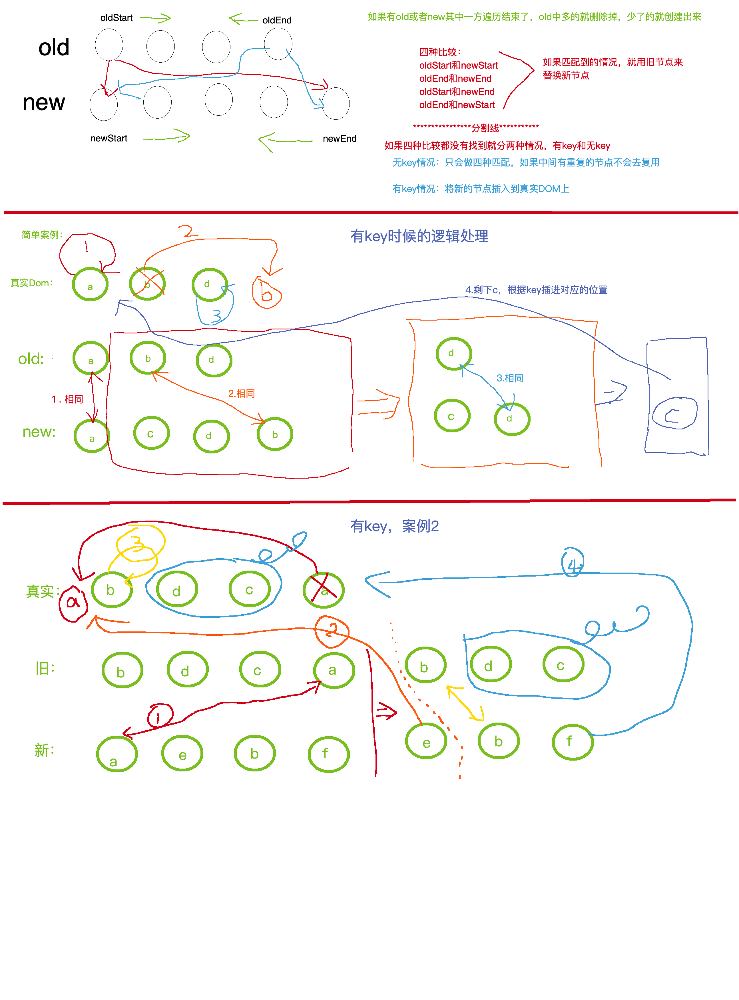

# 一、组件的通讯（6种方法）

[学习文章总结](https://github.com/ljianshu/Blog/issues/66)

## 方法一、props和$emit
- 父组件向子组件传值
给子组件元素中绑定属性，子组件中定义props中接受

- 子组件向父组件传值
子组件通过事项的形式，将数据传递给父组件

备注：**props只有只读属性，子组件不应该直接修改props中的值！！**


## 方法二、$on和\$emit
通过一个空的vue实例，作为事件总线`EventBus`，利用`$on`来做事件的监听，`$emit`做事件的发布,`$off`实现取消事件的监听。从而实现父子，兄弟，跨级等组件间的通讯。

```js
// 1.在main.js中，给Vue.prototype绑定EventBust
Vue.prototype.$eventBus = new Vue();

// 2. 在组件creted或者mounted中进行事件的订阅
this.$eventBus.$on("事件名" , "触发的回调方法")

this.$eventBus.$off("事件名" , "监听时候传入的回调")
/*
关于$off：
（1）如果没有传入参数，那么就会移除所有事件监听
（2）如果只传入了事件名称，那么就会移除该事件的所有金婷
（3）如果传入了事件名称，并且传入了对应的回调，那么就只会移除该回调的监听事件
*/

// 3. 触发发布事件
this.$eventBus.$emit("事件名" , "传给订阅事件的参数")

```


## 方法三、vuex和localStorage
vue生态中的一环，不做解释。


## 方法四、$attrs和\$listeners
- `$attr`：包含父作用域中不被props所识别且获取的特性。（class和style除外），可以通过`v-bind="$attrs"`传递给内部组件
- `$listeners`：包含了父作用域中（不含.native修饰器）的v-on事件监听器，可以通过`v-on="$listeners"`传递给内部组件
简单来说：`$attrs`与`$listeners`是两个对象，`$attrs`里存放的是父组件中绑定的非Props属性，`$listeners`里存放的是父组件中绑定的非原生事件。

## 方法五、provide和inject
- 祖先组件向其所有子孙后代注入一个依赖，不论组件层次有多深，并在起上下游关系成立的时间里始终生效。
- 概括：祖先组件中通过`provide`来提供变量，然后子组件中通过`inject`来注入变量。
- 使用场景：子组件获取上级组件的状态，跨级组件间建立了一种主动提供与依赖注入的关系。
- 注意：`provide`和`inject`的绑定并不是响应式的。
实现响应式的方法：
1. 传递组件组件实例
2. 使用`Vue.observable`优化

```vue
<!-- 简单用法 -->
<!-- 祖先组件中-->
export default {
    provide:{
        msg:"test-provide", // 组件自身渲染使用会报未定义
    },
    methods:{
        changeMsg(){
            this.msg = "test-provide-"+Math.random()
        }
    }
}
<!--子组件中获取-->
export default {
    inject:["msg"],// 如果祖先改变了值，这里并不会跟着改变。（对象类型可以）
}

<!--响应式实现用法 Vue.observable实现-->
<!-- 父组件-->
import Vue from "vue"
export default {
    provide(){
        this.article = Vue.observable({
            msg:"test-provide-0"
        })
        return {
            article:this.article
        }
    },
    methods:{
        changeMsg(){
          this.article.msg = "test-provide-"+Math.random()
      }
    }
}
<!--子组件-->
<template functional>
    {{injections.article.msg}}
</template>
export default {
    inject:{
        article:{
            default:() => {}
        }
    }
}
```


## 方法六、$parent和\$children，ref

- `ref`：如果用在普通Dom元素上，获取的是Dom元素的引用，如果用在子组件中，获取到的就是组件实例。
- `$parent/$children`：访问组件的父/子实例

通过使用组件实例中的`data`和`methods`来实现组件间的通讯

```vue
<!--父组件：往下传了四个属性:apple,banana,orange,lemon，两个方法:ok,cancel-->
<div>
    <son :apple="apple" :banana="banana" :orange="orange" :lemon="lemon" @ok="ok" @cancel="cancel"/>
</div>

data() {
  return {
      apple:"apple",
      banana:"banana",
      orange:"orange",
      lemon:"lemon",
  };
},
methods:{
    ok(data){
        this.count = data
    },
    cancel(){
        console.log("cancel")
    },
}
<!--子组件  son-->
<div>
    <grandson v-bind="$attrs" v-on="$listeners" />
</div>

props:{
    apple:String
}
created(){
    // 这里取到的$attrs就是除了apple,因为apple已经被props取了
    // 而$listeners就是ok，cancel
}

<!--孙组件 grandson-->
<div>
    <nextgrandson  v-bind="$attrs" v-on="$listeners"  />
</div>

props:{
    banana:String
}
created(){
    // 这里取到的$attrs就是除了apple,banana,因为apple,banana已经被props取了
    // 而$listeners就是ok，cancel
}

<!--曾孙组件 nextgrandson-->
<div>一堆内容</div>

props:{
    orange:String
}
created(){
    // 这里取到的$attrs就是lemon，其他已经被其他props取了
    // 而$listeners就是ok，cancel
}
```


# 二、vue的整个实现流程
## 整体流程图


- `new Vue`执行初始化
- 挂载`$mount`方法，通过自定义`render`方法，`template`，`el`等生成`render`函数
- 通过`Watcher`监听数据的变化
- 当数据发生改变时，`render`函数执行生成VNode对象
- 通过`patch`方法，对比新旧VNode对象，通过Dom Diff算法添加、修改、删除真正的Dom元素


# 三、vue中的三要素

## （一）响应式
### 数据劫持
vue2.x：利用`Object.definedProperty(obj , prop , descriptor)`方法中的第三个参数`descriptor`，中的`getter`和`setter`属性对**已经存在**的属性进行劫持。
vue3.x：利用`proxy`来代替`Object.defineProperty`的核心功能。（后续写到的时候再对proxy总结）
该方法接收的参数说明：
+ obj：目标对象
 + prop：需要定义、修改的属性
 + descriptor：类型`Object`
    - 字段`value`该属性的值，默认值为undefined
    - 字段`writable`该属性的值是否可以重写，true|false，默认为false
    - 字段`enumerable`该属性是否可以被枚举，true|false，默认为false
    - 字段`configurable`该属性的特性`descriptor`是否可以被删除或者修改，默认为false
    - `get`方法：获取该属性的时候会触发
    - `set`方法：设置该属性的时候会触发
**注意：**
1. 对象新增的属性不会触发get和set方法;
2. `value,writable`属性 不能和`get,set`方法同时出现，不然会报错;

```js
var person = {
    name : "小明",
    age: 19,
    sex: true,
}

function definedReactive(obj , prop , value){
    Object.defineProperty(obj , prop , {
        enumerable: true,
        configurable: true,
        get(){
            console.log(`触发了get------，${prop}`)
            return value
        },
        set(newVal){
            console.log(`触发了set++++++, ${prop}，newValue=${newVal}`)
            value = newVal
        }
        
    })
}

function observe(target){
    const keys = Object.keys(target)
    keys.forEach(k => {
        definedReactive(target , k , target[k])
    })
}

observe(person)
person.name = "小白" // 赋值
console.log(person.name)  // 取值，输出
person.say = "hello world!" // 给对象添加新属性
console.dir(person)

// 运行结果：
// 触发了set++++++, name，newValue=小白
// 触发了get------，name
// 小白
// {
//   name: [Getter/Setter],
//   age: [Getter/Setter],
//   sex: [Getter/Setter],
//   say: 'hello world!'
// }

// 不查看代码，如何查看数据是否有做响应式？
// 可以把数据输出，查看数据中是否有getter和setter方法

```
### 订阅-发布（观察者模式）


1. 将需要observe的数据对象进行递归遍历，包括子属性，都添加上getter和setter，这样给对象的某个值赋值的时候就会触发setter,就能监听到数据的变化。
2. compile解析模板指令，将模板中的变量替换成数据，然后初始化渲染页面视图，并将每个指令对应的节点绑定更新函数，添加监听数据的订阅者，一旦数据有变动，收到通知，就更新视图。
3. watcher订阅者是observe和compile之间通信的桥梁
    - 在自身实例化时往属性订阅器(dep)里面添加自己
    - 自身必须有一个update()方法
    - 待属性变动dep.notice()通知时，能调用自身的update()方法，并且触发compile中绑定的回调
4. mvvm作为数据绑定的入口，将observer,compile和watcher三者整合。

## （二）vue中的模板
1. 模板实际上就是一个字符串
2. 模板有逻辑，比如：`v-if`,`v-for`
3. 与html格式很像
4. 输出html来显示
5. 模板最终要转成一个JS函数(render函数)

## （三）渲染函数(render)
关于render函数可以查看[Vue原理之虚拟DOM和render函数](https://juejin.cn/post/6844903843206004743#heading-11)
总结render函数的编译几个步骤：

- 将template字符串解析成ast(Abstract Syntax Tree)抽象语法树
- 优化：将那些不会被改变的节点(statics)打上标记
- 生成render函数字符串，并且用with包裹（最新版本有改为buble）
- 通过new Function的方式生成render函数并且缓存

**几个关键点**
- `with使用`
```js
var person = {
    name:"小白",
    say(){
        console.log('hello ')
    }
}

function test(){
    console.log(person.name)
    person.say()
}
console.log("不使用with")
test()

function test1() {
    with(person){
        console.log(name)
        say()
    }
}
console.log("使用with")
test1()
```
- `createElement`是render函数提供的一个方法，接收三个参数。
  
    + 第一个参数：html标签，必传。（String|Object|Fuction）
    + 第二个参数：包含模板相关属性的对象，可选。
    + 第三个参数：子元素，可选。（String|Array）

```js
// 页面：
<div id="app">
    <my-component-1></my-component-1>
</div>
// 第一个参数
// 传入：String
Vue.component('my-component-1'  , {
    render(createElement) {
        return createElement('div')
    },
})
// 传入：Object
Vue.component('my-component-1'  , {
    render(createElement) {
        return createElement({
            template:"<div>hello world</div>"
        })
    },
})
// 传入：Function
Vue.component('my-component-1'  , {
    render(createElement) {
        let fun = function(){
            return {
                template:"<h1>hello world</h1>"
            }
        }
        return createElement(fun())
    },
})

// 第二个参数 , 第三个参数：
Vue.component('my-component-1'  , {
    render(createElement) {
        return createElement('div' , {
            class:"box-1",
            style:{"background":"red"}
        }, [
            createElement("p" , "goodbye")
        ])
    },
})


```

# 四、vue的diff算法
参考文案：
[详解vue的diff算法](https://juejin.cn/post/6844903607913938951#heading-11)
[解析vue2.0的diff算法](https://github.com/aooy/blog/issues/2)

## （一）经典图解
- vue和react的diff算法大同小异：**比较只会在同层级进行，不会跨层级比较**


- 虚拟DOM的属性
```js
{
  el:  div  //对真实的节点的引用，本例中就是document.querySelector('#id.classA')
  tagName: 'DIV',   //节点的标签
  sel: 'div#v.classA'  //节点的选择器
  data: null,       // 一个存储节点属性的对象，对应节点的el[prop]属性，例如onclick , style
  children: [], //存储子节点的数组，每个子节点也是vnode结构
  text: null,    //如果是文本节点，对应文本节点的textContent，否则为null
}
```
## （二）diff的过程就是调用patch函数
### 简单概括
    + 判断两个节点是否值得比较（根据key和选择器是否相等判断）
    + --> 不值得比较：找到oldVnode的父节点，根据vNode创建真实DOM，用新DOM替换旧DOM
    + --> 值得比较：执行`patchVnode`，`patchVnode`比较有五种情况
    + ----> (1) 判断新旧Vnode引用是否相同，相同就直接返回
    + ----> (2) 判断文本节点是否相同
    + ----> (3) 判断子节点是否一致，不一致调用`updateChildren`，更新children
    + ----> (4) 只有新节点有children，调用`createEle`，添加子节点
    + ----> (5) 新节点中没有子节点，老节点中有子节点，直接删除

### 1. `patch`函数有两个参数：旧的虚拟DOM和新的虚拟DOM

```js
function patch (oldVnode, vnode) {
	if (sameVnode(oldVnode, vnode)) {
		patchVnode(oldVnode, vnode)
	} else {
		const oEl = oldVnode.el
		let parentEle = api.parentNode(oEl)
		createEle(vnode)
		if (parentEle !== null) {
			api.insertBefore(parentEle, vnode.el, api.nextSibling(oEl))
			api.removeChild(parentEle, oldVnode.el)
			oldVnode = null
		}
	}
	return vnode
}
```

### 2. 判断两个DOM是否值得比较？怎么判断？
`sameVnode`方法：如果两个Dom的`key`和`sel`相等就会去做比较
```js
function sameVnode(oldVnode, vnode){
	return vnode.key === oldVnode.key && vnode.sel === oldVnode.sel
}
```

### 3. `patchVnode`方法，五种比较情况
- （1）判断引用是否相同
- （2）判断文本节点是否相同
- （3）判断子节点是否一致，不一致调用`updateChildren`
- （4）只有新节点有children，调用`createEle`添加子节点
- （5）新节点中没有子节点，老节点中有子节点，直接删除掉
```js
patchVnode (oldVnode, vnode) {
    const el = vnode.el = oldVnode.el
    let i, oldCh = oldVnode.children, ch = vnode.children
    if (oldVnode === vnode) return
    if (oldVnode.text !== null && vnode.text !== null && oldVnode.text !== vnode.text) {
        api.setTextContent(el, vnode.text)
    }else {
        updateEle(el, vnode, oldVnode)
    	if (oldCh && ch && oldCh !== ch) {
	    	updateChildren(el, oldCh, ch)
	    }else if (ch){
	    	createEle(vnode) //create el's children dom
	    }else if (oldCh){
	    	api.removeChildren(el)
	    }
    }
}
```

### 4. updateChildren分析（重点）
```js
updateChildren (parentElm, oldCh, newCh) {
    let oldStartIdx = 0, newStartIdx = 0
    let oldEndIdx = oldCh.length - 1
    let oldStartVnode = oldCh[0]
    let oldEndVnode = oldCh[oldEndIdx]
    let newEndIdx = newCh.length - 1
    let newStartVnode = newCh[0]
    let newEndVnode = newCh[newEndIdx]
    let oldKeyToIdx
    let idxInOld
    let elmToMove
    let before
    while (oldStartIdx <= oldEndIdx && newStartIdx <= newEndIdx) {
            if (oldStartVnode == null) {   //对于vnode.key的比较，会把oldVnode = null
                oldStartVnode = oldCh[++oldStartIdx] 
            }else if (oldEndVnode == null) {
                oldEndVnode = oldCh[--oldEndIdx]
            }else if (newStartVnode == null) {
                newStartVnode = newCh[++newStartIdx]
            }else if (newEndVnode == null) {
                newEndVnode = newCh[--newEndIdx]
            }else if (sameVnode(oldStartVnode, newStartVnode)) {
                patchVnode(oldStartVnode, newStartVnode)
                oldStartVnode = oldCh[++oldStartIdx]
                newStartVnode = newCh[++newStartIdx]
            }else if (sameVnode(oldEndVnode, newEndVnode)) {
                patchVnode(oldEndVnode, newEndVnode)
                oldEndVnode = oldCh[--oldEndIdx]
                newEndVnode = newCh[--newEndIdx]
            }else if (sameVnode(oldStartVnode, newEndVnode)) {
                patchVnode(oldStartVnode, newEndVnode)
                api.insertBefore(parentElm, oldStartVnode.el, api.nextSibling(oldEndVnode.el))
                oldStartVnode = oldCh[++oldStartIdx]
                newEndVnode = newCh[--newEndIdx]
            }else if (sameVnode(oldEndVnode, newStartVnode)) {
                patchVnode(oldEndVnode, newStartVnode)
                api.insertBefore(parentElm, oldEndVnode.el, oldStartVnode.el)
                oldEndVnode = oldCh[--oldEndIdx]
                newStartVnode = newCh[++newStartIdx]
            }else {
               // 使用key时的比较
                if (oldKeyToIdx === undefined) {
                    oldKeyToIdx = createKeyToOldIdx(oldCh, oldStartIdx, oldEndIdx) // 有key生成index表
                }
                idxInOld = oldKeyToIdx[newStartVnode.key]
                if (!idxInOld) {
                    api.insertBefore(parentElm, createEle(newStartVnode).el, oldStartVnode.el)
                    newStartVnode = newCh[++newStartIdx]
                }
                else {
                    elmToMove = oldCh[idxInOld]
                    if (elmToMove.sel !== newStartVnode.sel) {
                        api.insertBefore(parentElm, createEle(newStartVnode).el, oldStartVnode.el)
                    }else {
                        patchVnode(elmToMove, newStartVnode)
                        oldCh[idxInOld] = null
                        api.insertBefore(parentElm, elmToMove.el, oldStartVnode.el)
                    }
                    newStartVnode = newCh[++newStartIdx]
                }
            }
        }
        if (oldStartIdx > oldEndIdx) {
            before = newCh[newEndIdx + 1] == null ? null : newCh[newEndIdx + 1].el
            addVnodes(parentElm, before, newCh, newStartIdx, newEndIdx)
        }else if (newStartIdx > newEndIdx) {
            removeVnodes(parentElm, oldCh, oldStartIdx, oldEndIdx)
        }
}
```

- 图解说明：



### 5.vue中key的作用
- 不加key，只会做四种匹配，如果中间有重复不会去复用
- 不加key，那么vue会选择复用节点(Vue的就地更新策略),导致之前节点的状态被保留下来，会产生一系列的bug

# 五、vue的生命周期
正常情况下8个钩子：
- beforeCreate
- create
- beforeMount
- mounted
- beforeUpdate
- updated
- beforeDestory
- destoryed
如果使用了keep-alive会增加两个钩子：
- activated
- deactivated

