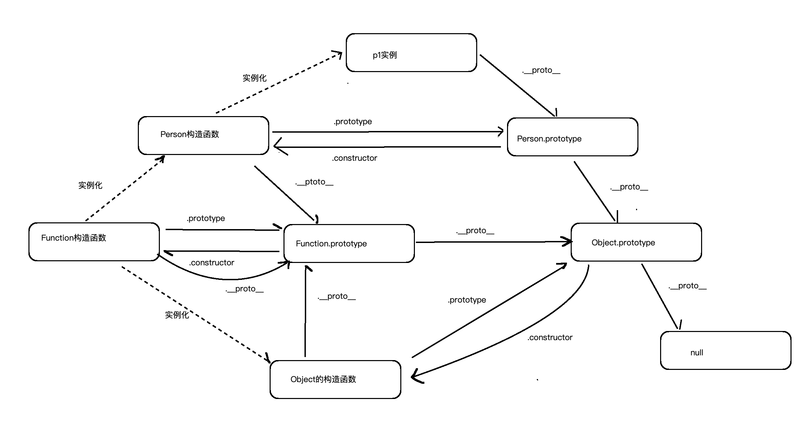
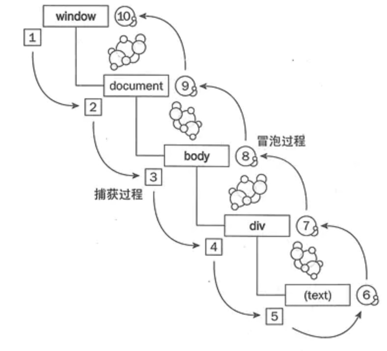

# JS基础篇
点击查看原文：[写给女朋友的中级前端面试秘籍](https://juejin.cn/post/6844904115428917255#heading-7)

## JS的数据类型
- 6种原始类型
    + Boolean
    + Undefined
    + Number
    + BigInt：比Number支持范围更大
    + String
    + Symbol：生成一个全局唯一的值
- null
- Object
- Function


## Set和Map
- ES6提供了新的数据结构`Set`。类似于数组，但是成员的值都是唯一的，没有重复的值。
利用`Set`和`Array.from`结合或者`Set`和结构运算符结合可以实现数组去重。
Set实例拥有的属性：
    + `Set.prototype.constructor`:默认指向`Set`构造函数
    + `Set.prototype.size`:返回`Set`实例成员总数
Set实例拥有的方法，分为两类：操作、遍历
    + `Set.prototype.add(value)`:添加某个值，返回Set结构本身
    + `Set.prototype.delete(value)`:删除某个值，返回Boolean，表示是否删除成功
    + `Set.prototype.has(value)`:返回Boolean，表示该值是否为Set成员
    + `Set.prototype.clear()`:清除所有成员，没有返回值
    + `Set.prototype.keys()`:返回键名的遍历器
    + `Set.prototype.values()`:返回键值的遍历器
    + `Set.prototype.entries()`:返回键值对的遍历器
    + `Set.prototype.forEach()`:使用回调遍历每一个成员


- ES6提供了新的数据结构`Map`。主要是为了解决传统对象只能使用字符串当做key值。
Map的key值可以各种数据类型格式，只要**内存地址**一致就认为是同一个key值。
Map实例拥有的属性
    + `size`
Map实例拥有的方法
    + `set(key , value)`
    + `get(key)`
    + `has(key)`
    + `delete(key)`
    + `clear()`
    + `keys()`
    + `values()`
    + `entries()`
    + `forEach()`


## WeakSet和Set ，WeakMap和Map
WeakSet和Set对比，成员只能是对象，而不能是其他类型的值；值是弱引用，对于垃圾回收更友好。
WeakMap和Map对比，只接受对象作为键名（null除外）；key值是弱引用，对于辣鸡回收更友好。


## 原型和原型链
- 构造函数都有一个`prototype`属性指向原型
- 原型都有一个`constructor`属性指向构造函数
- 实例对象都有`__proto__`属性指向原型
- 由实例和原型相互之间的关系组成的链状结构就是原型链
- 原型的终点是`null`



## this
详情点击查看：[JavaScript中的this](https://juejin.cn/post/6844903488304971789)
- 关键：**谁调用就指向谁**

函数的调用方式有四种：
1. 在全局环境或是普通函数中直接调用（在全局中使用的时候要区分严格模式(this指向undefined)和非严格模式(this指向window)）

2. 作为对象的方法使用
`this`指向调用它的对象

3. 使用apply和call、bind：都是用来改变this指向
区别：
```js
fn.call(obj1 , param1 , param2 ...)
fn.apply(obj1 , [param1 , param2 ...])
fn.bind(obj , param1 , param2 ...)()
```

4. 作为构造函数
如果作为构造函数使用，那么`this`就代表它即将`new`出来的对象
关键字`new`做了什么事情？
（1）创建一个临时对象（开辟一片内存区域）
（2）给临时对象绑定原型
（3）给临时对象对应的属性赋值（将this指向这一片内存区域）
（4）将对象return出去

- 箭头函数
箭头函数会捕获其所在上下文的`this`，作为自己的`this`值。call,apply无法改变。


## 深拷贝和浅拷贝
- 浅拷贝：值的拷贝（内存地址的拷贝）
- 深拷贝：完全拷贝对象的每一个值，包括简单类型和引用类型（内存地址不一样）

## 事件冒泡和事件捕获以及事件代理
详情点击查看：[你真的理解 事件冒泡 和 事件捕获 吗？](https://juejin.cn/post/6844903834075021326)

总结概括：
- **事件冒泡**（微软）和**事件捕获**（网景公司）主要是为了解决页面中**事件流**（事件发生顺序）的问题
- 事件冒泡：从最内层元素开始往上传播，知道document对象
- 事件捕获：从最外层开始发生，直到目标元素
事件冒泡和捕获过程图


- addEventListener的第三个参数
```js
// 第一个参数：绑定的事件名：click mounseenter...
// 第二个参数：事件触发执行的函数
// 第三个参数：可取值（true | false）true：在捕获阶段执行函数；false：在冒泡阶段执行函数
element.addEventListener(event , function , useCapture)
```

- 事件代理：点击目标元素后，事件冒泡到父元素触发绑定事件，利用`event.target`找到事件实际发生的元素，就可以达到预期效果
```html
<ul class="list-box">
    <li>1</li>
    <li>2</li>
    <li>3</li>
    <li>4</li>
    <li>5</li>
</ul>
<script>
    window.onload = function(){
        const listbox = document.querySelector('.list-box')
        listbox.addEventListener('click' , function(e){
            console.log(e.target.innerText)
        } , false)
    }
</script>
```

- 阻止事件冒泡
    + event.stopPropagation()
    + 事件处理中`return false`
    + event.target == event.currentTarget

- 阻止默认事件
    + event.preventDefault()
    + `return false`