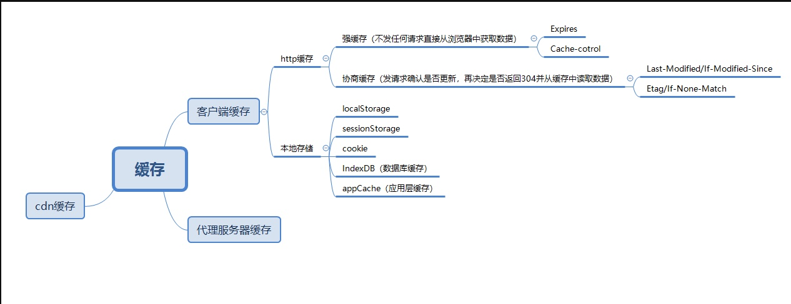

# 关于弹性布局

1. 设置在容器上的 6 个属性

- flex-direction：决定主轴的方向。取值：`flex-direction: row | row-reverse | column | column-reverse;`
- flex-wrap：定义换行形式。取值：`nowrap | wrap | wrap-reverse;`
- flex-flow：flex-direction 和 flex-wrap 简写。`flex-flow: <flex-direction> || <flex-wrap>;`
- justify-content：定义了主轴对齐方式。取值：`justify-content: flex-start | flex-end | center | space-between | space-around;`
- align-items：定义副轴上的对齐方式。取值：`flex-start | flex-end | center | baseline | stretch;`
- align-content：副轴上**多跟轴线**的对齐方式，如果只有一根轴线，该属性不起作用。取值：`flex-start | flex-end | center | space-between | space-around | stretch`

2. 设置在项目上的 6 个属性

- order：定义项目排列顺序，数值越小越靠前，默认为 0。
- flex-grow：定义项目放大比例，默认为 0，即存在剩余空间也不放大。
- flex-shrink：定义项目缩小比例，默认为 1，即空间不足就将该项目缩小。
- flex-basic：定义项目在分配多余空间前，占据主轴的空间，即项目的本来大小

```css
.item {
  flex-basis: <length> | auto; /* default auto 即项目本来的大小*/
  /* 可以写具体的px */
}
```

- flex：`flex-grow flex-shrink flex-basis`的简写，后面两属性可选。
- align-self：定义单个项目与其他项目不一样的对齐方式

```css
.item {
  align-self: auto | flex-start | flex-end | center | baseline | stretch;
}
```

# 两栏布局

1. 左边盒子浮动 + 右边盒子 bfc
2. 左边盒子绝对定位 + 右边盒子添加 margin-left
3. flex 布局： 左边盒子定宽 + 右边盒子 flex:1
4. table 布局： 父盒子 display:table;width:100%; + 左边盒子 display:table-cell

# 三栏布局

1. 圣杯布局：

```html
<div class="outter">
  <div class="middle">中间</div>
  <div class="left">左边</div>
  <div class="right">右边</div>
</div>
```

- 父盒子：bfc + 左右 padding
- 左中右三个盒子：左浮动 + 相对定位
- 中间盒子：width:100%
- 左边盒子：margin-left:-100%; left: -自身宽度
- 右边盒子：margin-left: -自身宽度; right: -自身宽度;

2. 双飞翼布局：
   与圣杯布局不一样的地方，中间盒子多添加一个内部盒子，通过调整内部盒子来控制中间内容

```html
<div class="outter">
  <div class="middle">
    <div class="inner">中间</div>
  </div>
  <div class="left">左边</div>
  <div class="right">右边</div>
</div>
```

- 父盒子：bfc
- 左中右三个盒子：左浮动 + 相对定位
- 中间盒子：width:100%
- 左边盒子：margin-left:-100%;
- 右边盒子：margin-left:-自身宽度;
- 中间内部盒子：margin-left:左边宽度;margin-right:右边的宽度;

3. 弹性布局

# 居中布局（6 种方法实现）

1. 基于视口的垂直居中
```css
.center {
  width: 300px;
  height: 300px;
  background-color: #ffcaca;
  margin: 50vh auto;
  transform: translateY(-50%);
}
```
2. 定宽居中：已知宽度
- 父元素：相对定位
- 子元素：绝对定位，top和left:50%;margin-left:-宽度的一半;margin-top:-高度的一半;

3. 未知宽度
- 父元素：相对定位
- 子元素：绝对定位，top和left:50%;transfrom:translate(-50% , -50%);

4. calc：已知宽度
- 父元素：相对定位
- 子元素：绝对定位，top：calc(50% - 高度的一半);left:calc(50% - 宽度的一半);

5. 弹性布局之方式一
- 父元素：display:flex;justify-content:center;align-items:center;

6. 弹性布局之方式二
- 父元素：display:flex；
- 子元素：margin: auto;


# 浏览器缓存机制


# requireJS  commonJs