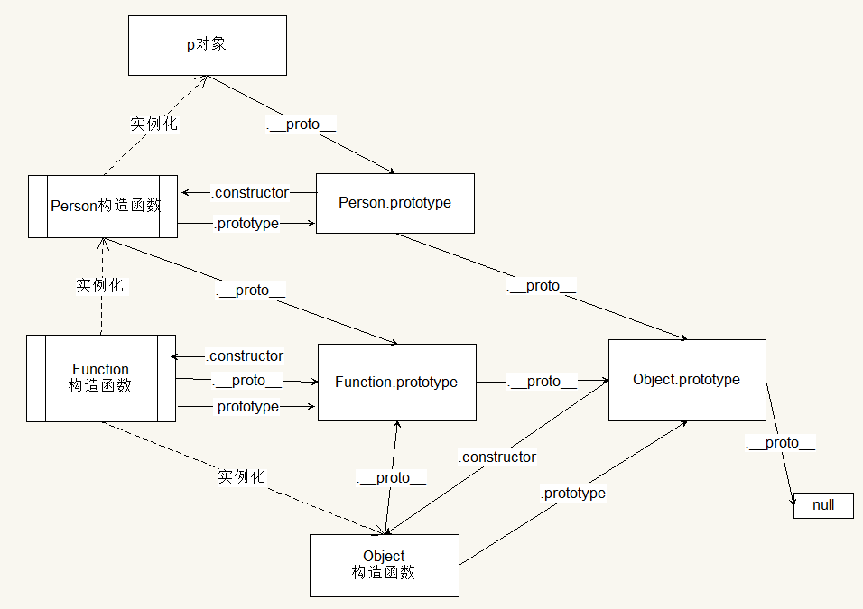
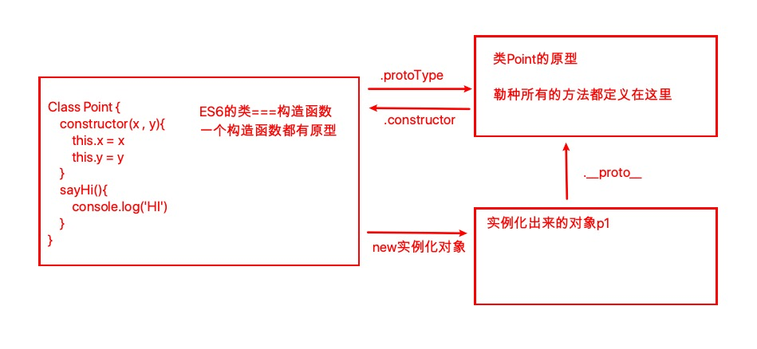

# 一、原型、原型链

## （一）引入:创建对象的几种方式
1. 使用字面量的方式
```js
new Object()
new Array()
new RegExp()
let obj = {
    key:value
}
```
2. 使用函数封装
```js
let createPerson = function(name , age){
    let obj = new Object()
    obj.name = name 
    obj.age = age
    return obj
}
```
3. 使用自定义构造函数
```js
function Person(name , age){
    this.name = name
    this.age = age
}
let p = new Person('xm' , 18)
```

## （二）构造函数
1. 什么是构造函数：构造函数是用来初始化对象的

2. 构造函数的特征：
- 首字母大写（规范）
- 构造函数一般和关键字`new`一起使用
- 构造函数不需要手动的写返回值

3. 构造函数执行过程
- 通过`new`关键字来创建对象（开辟内存空间）
- 调用构造函数，将构造函数中的this指向创建出来的对象
- 在构造函数内部，通过this对对象新增属性和方法--初始化操作
- 自动返回创建好的对象

4. 注意事项
- 如果在构造函数中写了return语句
    + 如果**返回简单数据类型**，不会对构造函数的返回值造成影响，依然是返回构造函数中创建的对象
    + 如果**返回了复杂数据类型**，那么构造函数就会返回该复杂数据类型
- 如果像调用普通函数一样调用构造函数
    + 函数中的this会指向window对象，通过this添加的所有属性和方法都会添加到window对象上
    + 如果函数中没有return语句，则返回undefined

## （三）传统构造函数存在的问题
问题：每一次创建对象都会将对象中声明的属性和方法都重新创建一次，造成浪费。
解决：提取公共的方法，将函数的定义放到构造函数以外，那么调用构造函数的时候，就不会去重复的创建。
缺点：全局变量污染，代码结构混乱。
为了解决这个问题所以引出了原型。

## （四）原型 (.protoType)
1. 什么是原型：构建函数创建出来的时候，系统会默认帮这个构造函数创建并且关联一个空的对象，这个**对象就是原型**
2. 原型的作用：通过和原型关联的构造函数所创建出来的对象，都会共享原型中声明的属性和方法（相当于后台语言中的父类）
3. 如何访问原型：通过`构造函数名称.protoType`获取原型，如`Person.protoType`
4. 如何在原型中添加属性和方法：
- 利用对象的动态特性为原型添加属性和方法`构造函数名称.protoType.key = value`
```js
Person.protoType.address = "guangzhou"
```
- 直接为构造函数的原型属性protpType赋值一个新的对象
```js
Person.protoType = {sex:1}
```
5. 使用原型注意事项：
- 原型的成员需要先添加再使用
- 公共的成员才可以放到原型中，不同对象的不同属性应该放在各自对象内
- 在获取某些成员的时候，如果当前对象中没有，才会去原型中获取
- 在使用对象设置属性的时候，只会在对象自身中查找，如果有就进行修改，如果没有就会新增
- 在给构造函数的原型属性protoType赋值一个新的对象，会造成赋值前后创建对象所指向的原型不一样，所以建议先赋值新对象之后，再通过构造函数创建对象

## （五）__proto__属性的介绍
- 每一个创建出来的对象，都有一个`__proto__`属性，这个属性指向的是原型
- `__proto__`是一个非标准的属性，不同的浏览器会有兼容的问题，所以不推荐在工作或者项目中使用，只在自己调试代码的时候使用
- 生产环境中，可以使用`Object.getPrototypeOf`方法来获取实例对象的原型

```js
function Person(name , age){
    this.name = name
    this.age = age
}
let p = new Person('xm' , 18)
console.log(Person.protoType === p.__proto__) // true
```
## （六）constructor属性介绍
- 原型中有一个`constructor`属性，该属性指向的是对应的构造函数
- 注意：当构造函数.protoType重新赋值为一个新的时候，新的对象中需要手动新增`constructor`属性指向构造函数，让原型可以正常的和构造函数关联起来，但是constructor属性不是必须要修改的内容，如果没有重新指向，对使用也不会有影响，但一般情况下都推荐改成正常的指向。


## （七）原型链
1. 概念：**对象都有原型，原型是一个对象**，所以原型又有原型，这样就形成了一个原型链
2. 属性搜索规则：当使用对象去访问一个属性或者方法的时候
- 现在对象自身中查找，找到就直接使用
- 如果没有找到就到对象的原型查找，找到就直接使用
- 如果没有找到就沿着原型链网上找，直到找到null

### 函数的原型链

### 完整的原型链


# 二、ES6之Class（类）
## （一）基本使用方法
- ES6提供引入了类的概念。可以通过关键字`class`来定义类，可以看作只是语法糖。
```js
class Point{
    //构造函数
    constructor(x , y){
        // 这里的this指向实例化的对象
        this.x = x
        this.y = y
    }
    // 这里定义的方法会被放到类的原型protoType中
    sayHi(){
        console.log('hello')
    }
}
```
- constructor方法：类默认的方法，如果没有显式定义，一个空的constructor方法会被默认添加


- 取值函数和存值函数(getter/setter):类的内部可以使用`get`和`set`关键字，对某个属性设置存取值函数，拦截该属性的存储行为
**存值函数和取值函数是设置在属性的 Descriptor 对象上的**
```js
class MyClass {
  constructor() {
    // ...
  }
  get prop() {
    return 'getter';
  }
  set prop(value) {
    console.log('setter: '+value);
  }
}

let inst = new MyClass();

inst.prop = 123;
// setter: 123

inst.prop
// 'getter'
```

## （二）静态属性和静态方法
1. 静态方法：类中定义的方法都会被实例继承，如果在一个方法前加上`static`关键字，就表示这个方法不会被继承，而是通过类来直接调用。
**PS:（1）父类的静态方法，可以被子类继承。（2）静态方法中的this指向类，而不是实例**
```js
class Foo {
  static classMethod() {
    return 'hello';
  }
}

Foo.classMethod() // 'hello'

var foo = new Foo();
foo.classMethod()
// TypeError: foo.classMethod is not a function
```
2. 静态属性
ES6 明确规定，Class 内部只有静态方法，没有静态属性。现在有一个提案提供了类的静态属性，写法是在实例属性的前面，加上static关键字
```js
// 老写法
class Foo {
  // ...
}
Foo.prop = 1;

// 新写法
class Foo {
  static prop = 1;
}
```

## （三）实例属性的新写法
实例属性除了定义在`constructor()`方法里面的`this`上面，也可以定义在类的最顶层。
```js
class Ponit {
    bar = 'hello';
    baz = 'world';
    constructor(){
        //do something
    }
}
//相当于
class Ponit{
    constructor(){
        this.bar = 'hello'
        this.baz = 'world'
    }
}
```


## （四）私有方法和私有属性
- 目前，有一个提案，为`class`加了私有属性。方法是在属性名之前，使用`#`表示。


## （五）继承
- Class可以通过`extends`关键字实现继承
```js
class Point {
    constructor(x , y){
        this.x = x
        this.y = y
    }
    toString(){
        return ` x=${this.x},y=${this.y}`
    }
}

class ColorPoint extends Point {
    constructor(x , y , color){
        super(x , y) // 调用父类的constructor(x, y)
        this.color = color
    }
    toString() {
        return this.color + ' ' + super.toString(); // 调用父类的toString()
    }
}
```
- super关键字
1. `super`作为函数调用，代表父类的构造函数。**ES6要求，子类的构造函数必须执行一次super函数**
2. `super`作为对象，在普通方法中，指向父类的原型对象；在静态方法中指向父类。

------

总结来自于：[《ES6入门教程》](http://es6.ruanyifeng.com/) 21、22章节