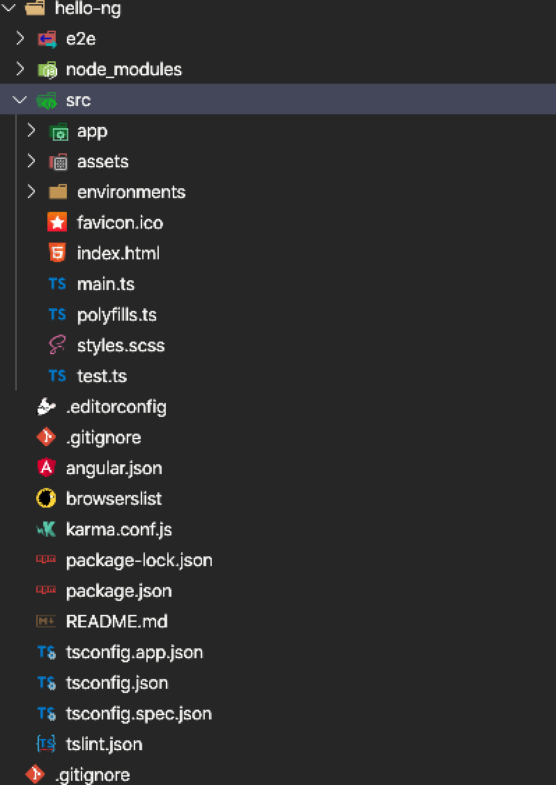
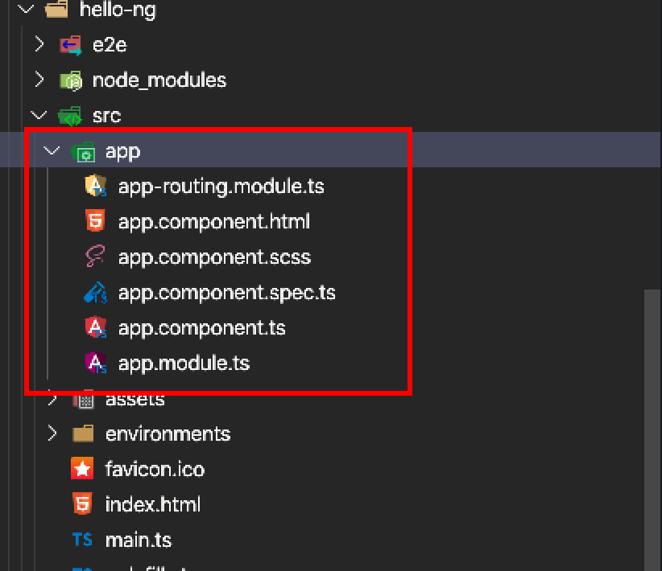

# Angular
Angular版本说明：
- AngularJS --> v1.x
- Angular   --> v2.x及其以上版本
- 编写该文档的时候使用的 Angular v9.x 最新

## Angular CLI    

1. 安装脚手架
```
npm install -g @angular/cli
```

2. 创建工作空间和初始应用
```
ng new my-app[项目名称]
```

3. 运行应用
```
cd my-app[项目名称]
ng serve --open
```

# 基本目录
根目录的目录结构


app下的目录结构



## 模块
Angular应用是模块化的。拥有自己的模块系统，称作**NgModule**。每一个Angular应用至少有一个NgModule类。文件叫做app.module.ts。
在项目中创建**模块**可以使用脚手架提供的命令`ng g(generate) m(module) path/name`

### @NgModule元数据
每一个模块中都会使用`@NgModule`去装饰。`@NgModule()`装饰器其实是一个函数，它接收一个元数据对象，用来描述这个模块，其中常用的属性：
- declarations：声明本模块中的组件、指令、管道
- imports：导入本模块中使用其他模块的东西
- exports：导出提供给其他模块使用的东西
- providers：使用的服务
- bootstrap：应用视图的根模块，只有根模块才设置`bootstrap`属性

### 模块与组件
模块为组件提供了一个**编译上下文环境**，模块总会有一个根组件，任何模块都能包含任意数量的的其他组件

### NgModule和JavaScript的模块
这两种模块系统是不同的，并且没有直接关联。在JavaScript中每一个文件就是一个模块，文件中定义的内容都是属于那个模块的，需要通过`export`关键字导出

### Angular自带的库
每个Angular库的名称都带有`@angular`前缀


## 组件
在项目中创建**组件**可以使用命令`ng g(generate) c(component) path/name`。
Angular中通过`@Component()`标记类，来说明这个类才是组件
组件会有创建、更新、销毁等行为，所以会有对应的可选**声明周期**：`ngOnChanges()`,`ngOnInit()`等，后续详细描述。

### 组件中的元数据
`@component()`接收一个配置对象，常用的属性：
- selector：告诉Angular，如果在模板中遇见这个选择器对应的标签，就将内容解析成该组件。（相当于定义组件的标签名）
- templateUrl：该组件的模板路径
- template：该组件的模板，直接将模板写在里面
- styleUrls：模板对应的样式文件
- prodivers：该组件中所需服务的提供者的一个数组

### 模板语法
跟标准的html很相似，但是还包含Angular的模板语法，逻辑、数据绑定、管道等。[官方文档关于模板语法](https://angular.cn/guide/template-syntax)
例：
```html
<!--Angular中的数据绑定-->
<li>{{hero.name}}</li>
<li [title]="hero.msg">绑定属性</li>
<li (click)="selectHero(hero)">点击测试</li>
<input type="text" [(ngModel)]="inputMsg">
```

- 数据绑定
数据双向绑定依赖模块`import { FormsModule } from '@angular/forms'`
在模块装饰器中引入：`imports:[FormsModule]`
用法`<input type="text" [(ngModel)]="inputMsg">`

- 管道
Angular中的管道可以作用于模板显示值的转换，可以使用内置管道，也可以自定义管道。
[官方文档关于管道](https://angular.cn/api?type=pipe)

- 指令 
Angular中的指令就是让模板中的dom，内容根据**指令**来进行转换显示。
[官方文档关于指令](https://angular.cn/guide/template-syntax#built-in-directives)
结构型指令
- `*ngFor`：迭代器，根据数据做遍历渲染，需要添加`trackBy`方法可以做数据优化
```html
<li *ngFor="let item of list"> {{item}}</li>
```
- `*ngIf`：条件判断，页面整个dom消失隐藏
属性型指令
- `[(ngModel)]`

## 服务与依赖注入
在项目中创建**服务**可以使用命令`ng g(generate) s(service) path/name`

### 服务
Angular中定义了**服务类**，服务为组件提供处理问题的更明确的方法，做一些更具体的事情。Angular将组件和服务进行了区分，来提高模块性和服用性。**理想情况下，组件只管用户体验，只提供数据绑定的属性和方法**。组件应该将从服务器获取数据，验证用户输入等内容交给服务。

### 依赖注入dependency injection (DI)
在Angular中定义一个服务类，要使用`@Injectable()`装饰器。`@Injectable()`装饰器也可以用来表明一个组件或者其他类（另外一个服务、管道、NgModule）拥有一个依赖。**依赖它不一定是服务，它还可以是函数或者值**

`@Injectable()`接收的也是一个对象，其中
- providedIn：说明服务的提供者，root表示注册在根，这样可以让它随处可用。也可以为特定的的模块或者组件注册提供者。

## 路由
Angular中的路由是使用HTML5的`history.pushState()`和`history.replaceState()`来实现。
浏览器的三种导航：
- 页面地址栏上输入URL
- 在页面中点击链接
- 浏览器的前进，后退按钮

### 基本知识
1. `<base href>`元素
index.html页面中添加`<base-href="/">`

2. 从路由库中导入`import { RouterModule, Routes } from '@angular/router';`

3. 配置路由
```ts
// 引入组件
import { AppHomeComponent } from './app-home/app-home.component'
import { AppAboutComponent } from './app-about/app-about.component'
// 引入路由
import { RouterModule, Routes } from '@angular/router';
// 定义路由
const appRoutes: Routes = [
  { path : '/home' , component : AppHomeComponent} , 
  { path : '/about' , component : AppAboutComponent}
];
// 模块声明
@NgModule({
  declarations: [
    AppHomeComponent,
    AppAboutComponent
    // ...
  ],
  imports: [
    FormsModule,
    RouterModule.forRoot(
      appRoutes,
      { enableTracing: true }
    )
    // ...
  ],
  providers: [],
  bootstrap: [AppComponent]
})
```
```html

```

## HttpClient


