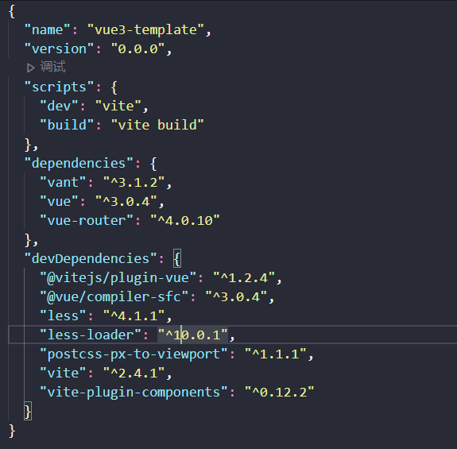

# 使用 vite 构建 vue3 项目
- [项目git地址](https://github.com/wenxuelin2521/vite-vue3-template)
- [vite 文档](https://cn.vitejs.dev/)
- [vue3 文档](https://v3.cn.vuejs.org/)
- [vue-router@4](https://next.router.vuejs.org/zh/index.html)
- [vant-ui 文档](http://vant-contrib.gitee.io/vant/#/zh-CN/)
  文档记录日期为：20210710，所安装或者使用的依赖把版本如下：
  

## 创建项目

- 使用`npm`

```sh
npm init vite-app project-name
cd project-name
npm install
npm run dev
```

- 默认构建出来的文件目录
  

## 添加css预处理器
因为选择了vant-ui，所以使用less作为css预处理

```sh
npm install less less-loader --save-dev
```

## 添加配置文件
Vite会自动解析项目根目录下名为`vite.config.js`的文件

- 添加基础配置
```js
import { defineConfig } from 'vite' // 备注：vite2.x版本才有这个方法
import vue from "@vitejs/plugin-vue"; // 解析.vue单文件组件
import path from "path"; // 路径模块
export default defineConfig({
  resolve: {
    alias: {
      "@": path.resolve(__dirname, "./src"), // 添加文件路径别名
    },
    plugins: [
      vue()
    ],
  },
})
```

## 添加路由

- 运行安装命令

```sh
npm install vue-router@4
```

- 添加路由配置文件，添加视图文件
  

```js
// 路由配置
import { createRouter, createWebHashHistory } from "vue-router";

const router = createRouter({
  history: createWebHashHistory(),
  routes: [
    {
      path: "",
      redirect: "/home",
    },
    {
      path: "/home",
      component: () => import("../views/Home/index.vue"),
    },
    {
      path: "/about",
      component: () => import("../views/About/index.vue"),
    },
  ],
});

export default router;
```

```js
// 在入口js中注入
import { createApp } from "vue";
import App from "./App.vue";
import "./index.css";
import router from "./router";

createApp(App).use(router).mount("#app");
```

## 添加 Vant-UI

- 运行安装命令，

```sh
npm i vant@next --save
```

- 引入组件：自动按需引入组件（推荐）

1. 安装插件，这里使用 [vite-plugin-components](https://github.com/antfu/vite-plugin-components) 来进行按需加载（备注： babel-plugin-import 使用不了）

```sh
npm i vite-plugin-components -save-dev
```

2. 配置 vite.config.js

```js
import ViteComponents, { VantResolver } from "vite-plugin-components";
export default defineConfig({
  ...
  plugins: [
    ViteComponents({
      customComponentResolvers: [
        VantResolver(),
      ]
    }),
  ],
  ...
})
```

3. 在入口 js 文件中引入注册即可使用

```js
...
// 引入vantui组件
import {
    Button
} from "vant"

const app = createApp(App)
app.use(Button) // 注册组件
...
```

## 移动端适配

- 使用Viewport适配（这里介绍这种，其他有需要可以自行查看）
  + [postcss-px-to-viewport](https://github.com/evrone/postcss-px-to-viewport)

1. 安装依赖
```sh
npm install postcss-px-to-viewport --save-dev
```

2. 在项目根目录中添加postcss.config.js配置文件，添加配置
```js
module.exports = {
  plugins: {
    "postcss-px-to-viewport": {
      viewportWidth: 375,
    },
  },
};
```

- 使用Rem适配
  + [postcss-pxtorem](https://github.com/cuth/postcss-pxtorem)
  + [lib-flexible](https://github.com/amfe/lib-flexible)


## 参考
- [vue3 实战系列：Vue3.0+Vant3.0 搭建种子项目](https://juejin.cn/post/6887590229692121096#heading-2)
