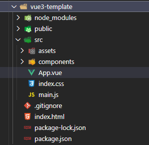
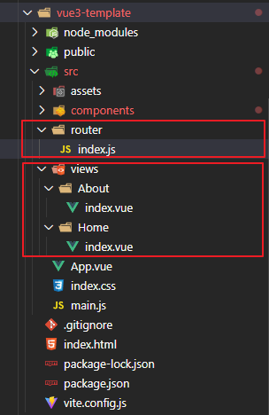

# 使用vite构建vue3项目
- [vite文档](https://cn.vitejs.dev/)
- [vue3文档](https://v3.cn.vuejs.org/)
- [vue-router@4](https://next.router.vuejs.org/zh/index.html)
- [vant-ui文档](http://vant-contrib.gitee.io/vant/#/zh-CN/)
文档记录日期为：20210710，所安装或者使用的依赖把版本如下：

## 创建项目

- 使用`npm`
```sh
npm init vite-app project-name
cd project-name
npm install
npm run dev
```
- 默认构建出来的文件目录



## 添加路由
- 运行安装命令
```sh
npm install vue-router@4
```
- 添加路由配置文件，添加视图文件


```js
// 路由配置
import { createRouter, createWebHashHistory } from "vue-router";

const router = createRouter({
  history: createWebHashHistory(),
  routes: [
    {
      path: "",
      redirect: "/home",
    },
    {
      path: "/home",
      component: () => import("../views/Home/index.vue"),
    },
    {
      path: "/about",
      component: () => import("../views/About/index.vue"),
    },
  ],
});

export default router;

```

```js
// 在入口js中注入
import { createApp } from 'vue'
import App from './App.vue'
import './index.css'
import router from './router'

createApp(App).use(router).mount('#app')

```


## 添加Vant-UI
- 运行安装命令，
```sh
npm i vant@next --save
```

- 引入组件：自动按需引入组件（推荐）
```sh
npm install babel-plugin-import --save-dev #安装babel插件
```
项目根目录中添加`babel.config.js`
```js
module.exports = {
    plugins: [
        ['import', {
            libraryName: 'vant',
            libraryDirectory: 'es',
            style: true
        }, 'vant']
    ]
};
```
在入口js文件中引入注册即可使用
```js
// 引入vantui组件
import { createApp } from 'vue'
import App from './App.vue'
import './index.css'
import router from './router'

// 引入vantui组件
import {
    Button
} from "vant"

const app = createApp(App)
app.use(router)

app.use(Button) // 注册组件

app.mount('#app')
```


## 移动端适配

## 添加配置文件


## 参考
- [vue3实战系列：Vue3.0+Vant3.0搭建种子项目](https://juejin.cn/post/6887590229692121096#heading-2)


