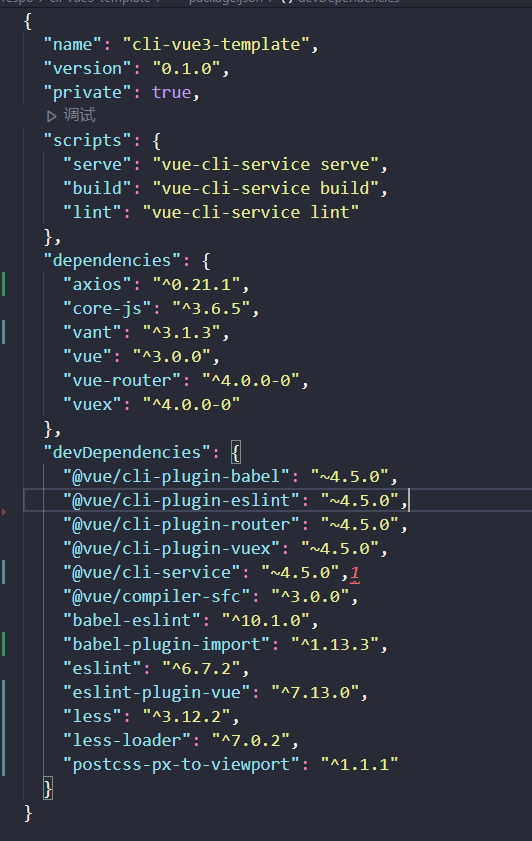

# 使用@vue/cli 构建一个 vue3 项目

文档记录日期为：20210713，所安装或者使用的依赖把版本如下：


## 安装 cli

- 运行命令

```sh
npm install -g @vue/cli # 安装
vue --version # 验证安装，版本需要v4.5+
```

## 创建项目

- 运行命令

```sh
vue create <project-name>
#然后根据实际需求来选择配置

cd <project-name>

npm run serve

```

## 改造项目目录结构


## 添加配置文件

在项目根目录中添加 vue.config.js

```js
module.exports = {
  publicPath: "/",
  outputDir: "www", // 将构建好的文件输出到哪里
  pages: {
    index: {
      // page 的入口
      entry: "src/pages/index/main.js",
      // 模板来源
      template: "public/tpl.html",
      // 在 dist/index.html 的输出
      filename: "index.html",
      // 当使用 title 选项时，
      // template 中的 title 标签需要是 <title><%= htmlWebpackPlugin.options.title %></title>
      title: "cli-vue3-template",
      // 在这个页面中包含的块，默认情况下会包含
      // 提取出来的通用 chunk 和 vendor chunk。
      chunks: ["chunk-vendors", "chunk-common", "index"],
    },
  },
};
```

## 添加 Vant-UI

- 安装

```sh
npm i vant@next -save
```

- 配置按需引入组件

1. 运行命令，进行安装

```sh
npm i babel-plugin-import -save-dev
```

2. 根目录中`babel.config.js`文件添加：

```js
module.exports = {
  ...
  plugins: [
    ['import', {
      libraryName: 'vant',
      libraryDirectory: 'es',
      style: true
    }, 'vant']
  ]
  ...
};
```

3. 入口文件中进行注册

```js
...
import { Button } from 'vant';
const app = createApp(App)
app.use(Button)
...
```

- 定制主题配置

1. 修改`babel.config.js`

```js
module.exports = {
  plugins: [
    [
      "import",
      {
        libraryName: "vant",
        libraryDirectory: "es",
        // 指定样式路径
        style: (name) => `${name}/style/less`,
      },
      "vant",
    ],
  ],
};
```

2. 修改`vue.config.js`配置

```js
module.exports = {
  css: {
    loaderOptions: {
      less: {
        // 若 less-loader 版本小于 6.0，请移除 lessOptions 这一级，直接配置选项。
        lessOptions: {
          modifyVars: {
            // 直接覆盖变量
            "text-color": "#111",
            "border-color": "#eee",
            // 或者可以通过 less 文件覆盖（文件路径为绝对路径）
            hack: `true; @import "your-less-file-path.less";`,
          },
        },
      },
    },
  },
};
```

## 移动端适配

- 使用Viewport适配（这里介绍这种，其他有需要可以自行查看）
  + [postcss-px-to-viewport](https://github.com/evrone/postcss-px-to-viewport)

1. 安装依赖
```sh
npm install postcss-px-to-viewport --save-dev
```

2. 在项目根目录中添加postcss.config.js配置文件，添加配置
```js
module.exports = {
  plugins: {
    "postcss-px-to-viewport": {
      viewportWidth: 375,
    },
  },
};

```
## 添加 axios
1. 安装
```sh
npm install axios --save
```
2. 在service文件夹中定义拦截请求拦截
```js
// example
axios.interceptors.response.use(res => {
  if (typeof res.data !== 'object') {
    Toast.fail('服务端异常！')
    return Promise.reject(res)
  }
  if (res.data.resultCode != 200) {
    if (res.data.message) Toast.fail(res.data.message)
    if (res.data.resultCode == 416) {
      router.push({ path: '/login' })
    }
    return Promise.reject(res.data)
  }

  return res.data
})
```