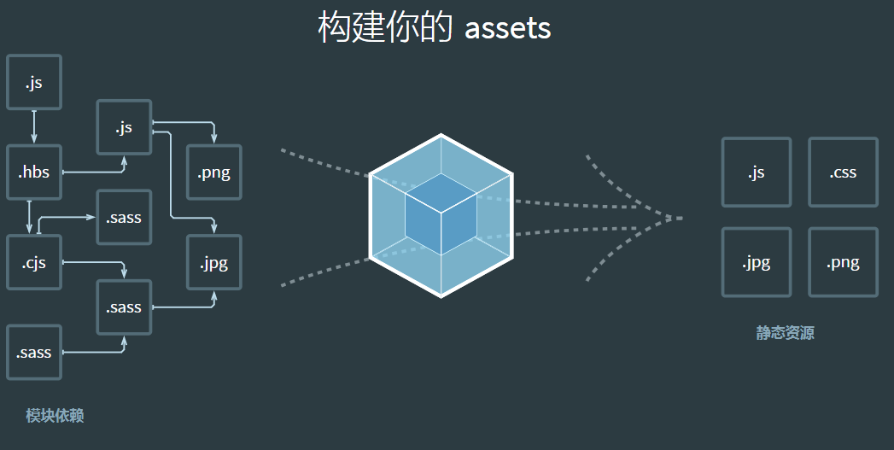

# webpack 介绍

**写在前面**：本文记录时间是 2021-04-07，**webpack5**已经正式发布了（2020-10-10）。出于学习总结的目的，本文还是先使用 webpack4.x 版本来，后续再补充 5.x 版本的内容。

**webpack 定义**：本质上，webpack 是一个现代 Javascript 应用程序的静态模块打包器。当 webpack 处理应用程序的时候，它会递归地构建一个以来关系图，其中包含应用程序需要的每个模块，然后将所有这些模块打包成一个或多个 bundle。

**webpack 大致工作流程**（面试有时候会问到）：

1. 根据 shell 和配置文件初始化参数；
2. 从上一步中得到的参数，用于初始化 complier，加载插件；
3. 开始编译：从入口文件开始，将依赖模块交给 loader 去做翻译，如果模块中以来其他模块，它会继续递归下去直至完成；
4. 编译完成：得到文件的依赖关系；
5. 开始组装：将模块切成单独文件和 chunk 块；
6. 输出完成：将文件输出到文件系统；



## webpack 基础配置

### 1. webpack 四大核心概念

- 入口（entry）：程序入口 js
- 输出（output）：打包后存放的位置
- loader：用于对模块的源代码进行转换
- 插件（plugins）：插件的目的在于解决 loader 无法实现的其他事

### 2. 初始化项目

- 新建文件夹`webpack-basic`，切换到文件夹中，在终端中运行`npm init -y`初始化项目。

- 安装依赖：使用的版本号分别是webpack@4.44.2 webpack-cli@3.3.11

  ```shell
  npm install webpack@4.44.2 webpack-cli@3.3.11 -D
  ```

- webpack4.0 之后可以实现 0 配置打包构建，但开发中还是使用配置文件来进行打包构建，所以创建配置文件`webpack.config.js`

  ```js
  const path = require("path");

  module.exports = {
    mode: "development", // 默认取值为production ，区别就是是否进行压缩混淆
    // 入口文件配置
    entry: "./src/index.js",

    // 输出文件配置
    output: {
      path: path.join(__dirname, "dist"), // 输出路径规定必须是绝对路径
      filename: "bundle.js", // 输出文件名字
    },
  };
  ```

- 将`webpack`命令配置在`package.json`的脚本中`"build": "webpack"`
- 运行命令`npm run build`

```shell
"scripts": {
    "build": "webpack",
},
```

### 3. 开发时自动编译工具

使用自动化编译工具是**为了提高开发效率**，项目上线时都会直接使用 webpack 进行打包构建，不需要使用这些自动编译工具。

#### watch

- 使用方法 1：直接使用命令：`webpack --watch`，在 package.json 中的 scripts 配置

```shell
"scripts": {
    "watch": "webpack --watch"
},
```

- 使用方法 2：在配置文件`webpack.config.js`中配置`watch: true`

```js
module.exports = {
  // other configs......
  watch: true,
};
```

#### webpack-dev-server

安装`devServer`，devServer 需要依赖 webpack，所以项目中必须安装`webpack`

```sh
npm install webpack-dev-server@3.11.2 -D
```

devServer 默认会将项目根目录作为服务的根目录，所以在项目根目录中新建一个 html 文件，引入 bundle.js

- 使用方法 1：直接使用命令脚本

```sh
npx webpack-dev-server --hot --open --port 8000
```

- 使用方法 2：在配置文件中进行配置

```js
module.exports = {
  // other configs......
  devServer: {
    port: 8000, // 指定端口
    open: true, // 打开浏览器
    hot: true, // 开启热更新
  },
};
```

#### 使用 html-webpack-plugin

1. 使用了`html-webpack-plugin`，devServer 会根据模板在项目根目录生成 html 文件
2. 然后将 bundle.js 自动引入
3. 打包的时候生成 html 文件

#### webpack-dev-middleware

用的比较少，需要安装 express 和 webpack-dev-middleware，这里就不做介绍了。
其实就是自己启动一个 express 服务。

### 4. 处理 css/less/sass

webpack 不能直接处理除 js 外的文件，需要借助`loader`担任翻译官的角色。
loader 经常会遇到更新迭代带来的问题，最好的方法是去看官网或者 github。
loader 的执行顺序是**从右到左**

- 处理.css: `style-loader`、`css-loader`
- 处理.less: 在 css 的基础上添加`less-loader`，less-loader 得配合`less`使用
- 处理.scss: 在 css 的基础上添加`sass-loader`，sass-loader 还得配合`sass`使用

```js
module : {
    rules : [
        {test: /\.css$/, use: ['style-loader' , 'css-loader']},
        {test: /\.less$/, use: ['style-loader' , 'css-loader' , 'less-loader']},
        {test: /\.s(c|a)ss$/, use: ['style-loader' , 'css-loader' , 'sass-loader']},
    ]
},
```

### 5. 处理图片和字体

可以使用`url-loader`或者`file-loader`来处理本地的资源文件。这两个 loader 功能类似，但是`url-loader`可以配置文件大小限制。所以选择`url-loader`，url-loader 里面封装了 file-loader，所以安装的时候需要两个都安装。

```shell
npm install file-loader url-loader -D
```

```js
module: {
  rules: [{
      test: /\.(png|jpg|gif)/,
      use: [{
          loader: "url-loader",
          options: {
            limit: 5 * 1024,
            outputPath: "images",
            name: "[name]-[hash].[ext]",
          }
      }]
  }];
}
```

### 6. 使用babel处理高级 javascript 语法 ES6/7/8

### 7. source map的使用
`devtool`可以帮助我们将编译后的代码映射到源代码，不同的dev-tool会影响到构建和重新构建的速度。
种类太多，这里就不再详述，感兴趣可以自己去看。这里选择使用`cheap-module-eval-source-map`
```js
module.exports = {
  devtool: 'cheap-module-eval-source-map'
}
```

### 8. 基础插件

- `clean-webpack-plugin`:用于打包静态资源的时候自动清除`dist`目录
```shell
npm install clean-webpack-plugin --save-dev
# 此处使用的版本号是clean-webpack-plugin@3.0.0
```

```js
const {CleanWebpackPlugin} = require('clean-webpack-plugin')

module.exports = {
  plugins : [
    new CleanWebpackPlugin()
  ]
}

```
- `copy-webpack-plugin`:拷贝插件，将指定文件从源拷贝到目标
```shell
npm install copy-webpack-plugin --save-dev
# 此处使用的版本号是copy-webpack-plugin@5.0.3
```

```js
new CopyPlugin([
  { from : path.join(__dirname , './src/assets') , to : 'assets'}
])
```


- `BannerPlugin`:webpack内置插件，用于给打包的JS文件添加上版权信息
```js
new webpack.BannerPlugin('good good study!')
```


## webpack 高级配置

## webpack 性能优化

## webpack 原理
