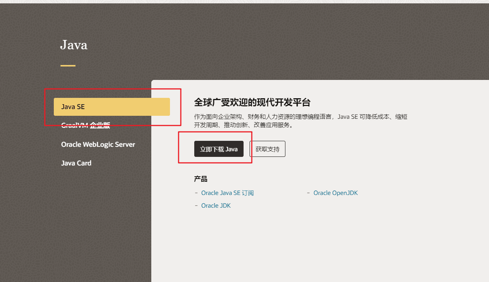
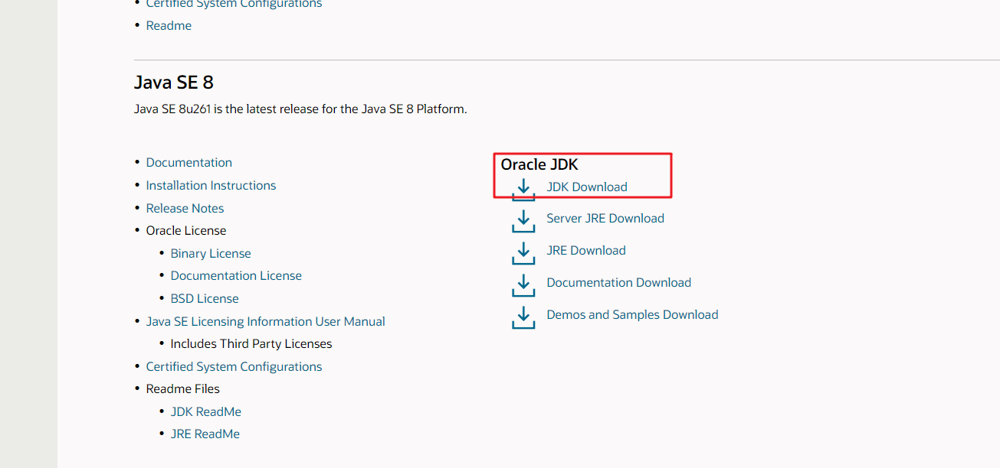
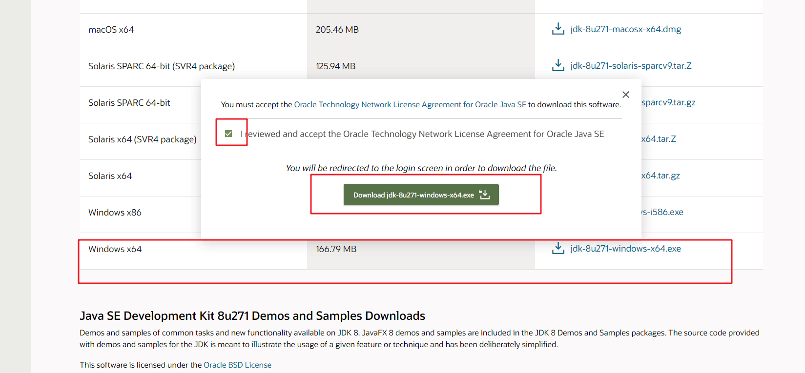
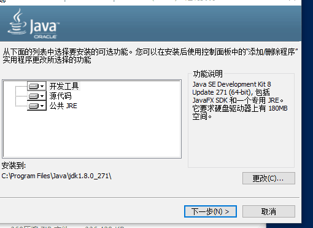
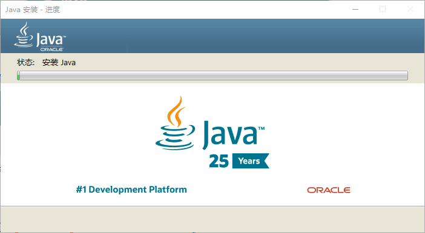
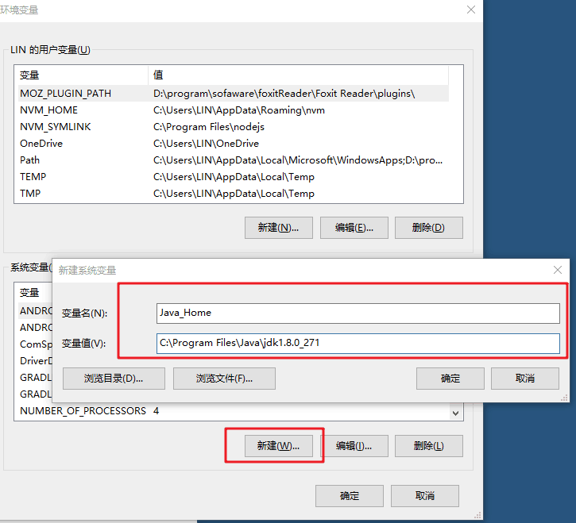
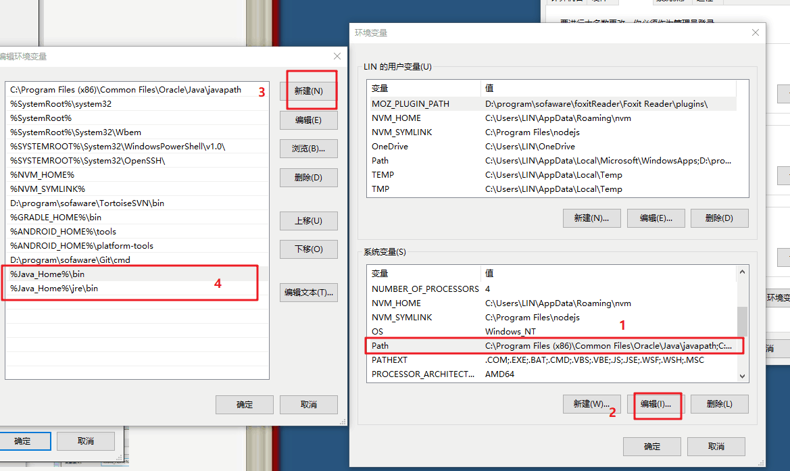
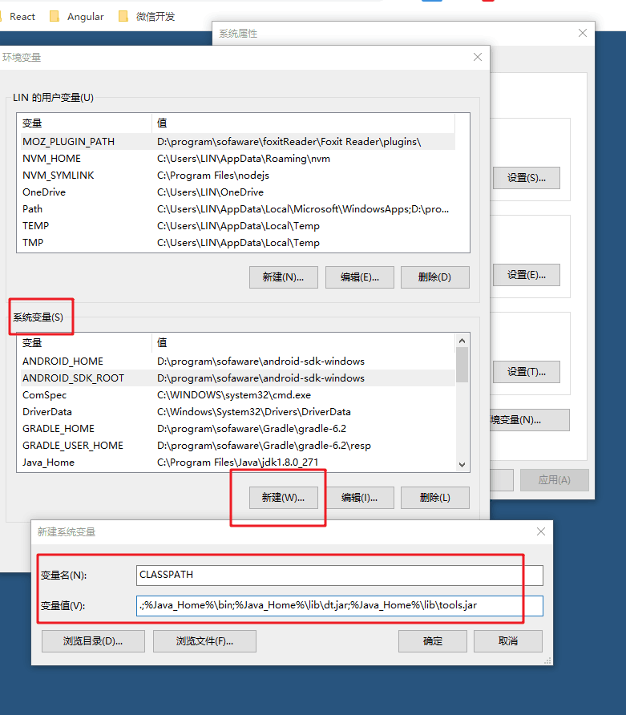
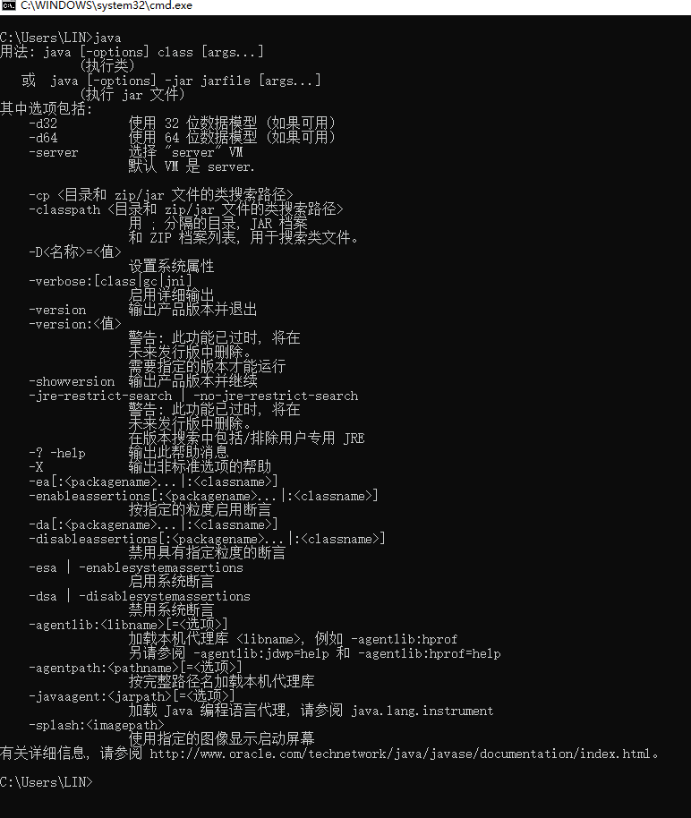

# java-jdk下载，安装以及配置（window平台，使用jdk1.8）

## 一、登录[oracle官网](oracle.com/cn/java)，没有账号需要先注册账号

备注：需要下载对应自己电脑系统的版本

- 步骤1

- 步骤2

- 步骤3


## 二、傻瓜式安装，下一步，下一步即可，jre也是



## 三、系统环境变量配置

- 新建变量`Java_Home`，变量值为jdk安装路径`C:\Program Files\Java\jdk1.8.0_271`



- 编辑`Path`,添加`%Java_Home%\bin`和`%Java_Home%\jre\bin`



- 新建变量`CLASSPATH`，变量值`.;%Java_Home%\bin;%Java_Home%\lib\dt.jar;%Java_Home%\lib\tools.jar`




## 四、验证安装配置是否成功三条命令
```
java
javac
java -version
```



