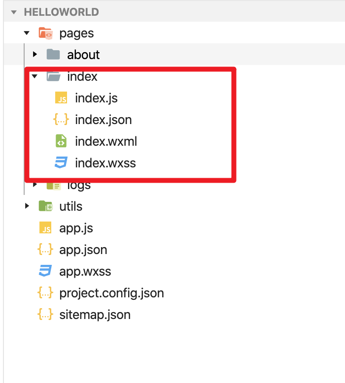

# mina框架
小程序开发框架的目标是通过尽可能简单、高效的方式让开发者可以在微信中开发具有原生 APP 体验的服务。

框架提供了自己的视图层描述语言 `WXML` 和 `WXSS`，以及基于 `JavaScript` 的逻辑层框架，并在视图层与逻辑层间提供了数据传输和事件系统，让开发者能够专注于数据与逻辑。

[官网]: https://developers.weixin.qq.com/miniprogram/dev/framework/MINA.html

## 小程序文件结构与传统web开发作对比

| 结构 | 传统web | mina小程序 |
| ---- | ------- | ---------- |
| 结构 | html    | wxml       |
| 样式 | css     | wxss       |
| 逻辑 | js      | js         |
| 配置 | 无      | json       |

