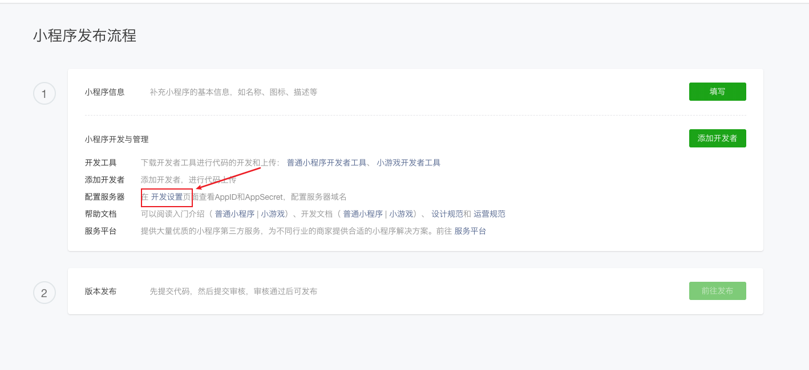
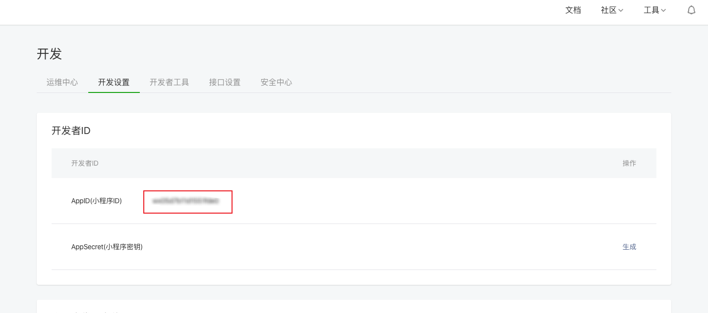
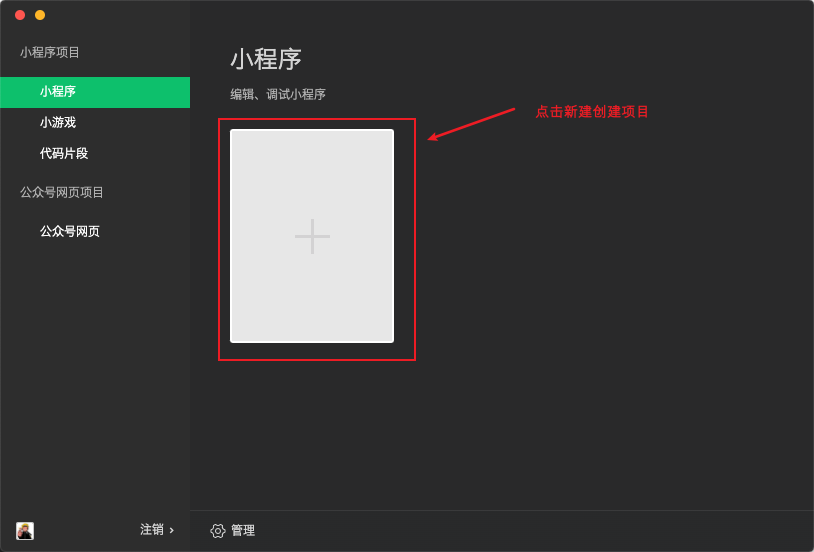
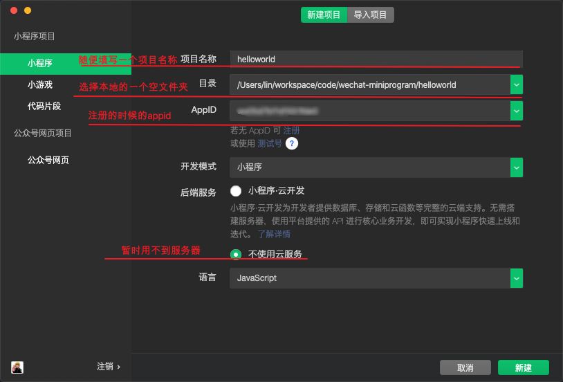
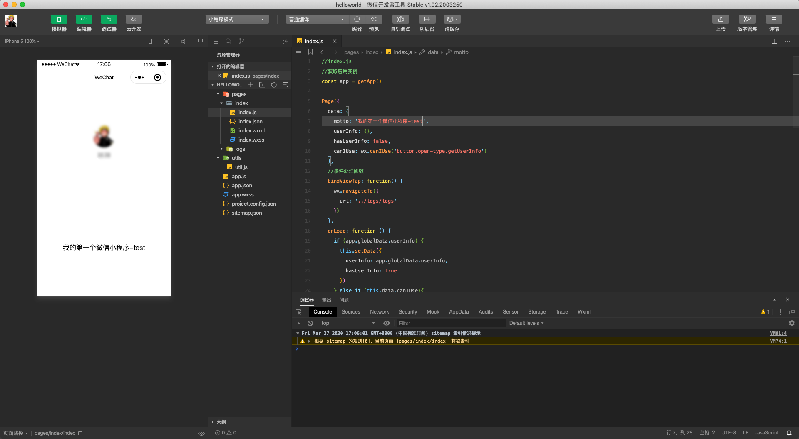
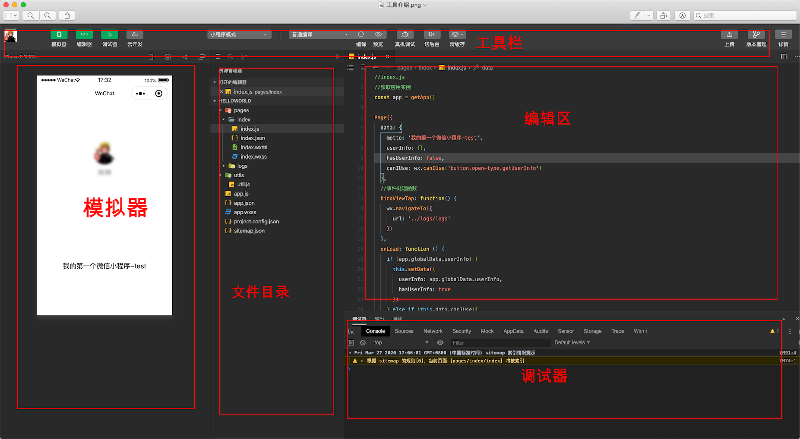

# 一、关于小程序
## （一）mina

  - 微信小程序开发基础

## （二）wepy

  - 腾讯团队推出的类vue小程序组件化开发框架

## （三）mpvue

  - 美团类vue的小程序前端框架

## （四）taro

  - 京东 React 语法规范的多端统一开发框架

# 二、开发环境准备
## （一）注册账号
- 注册地址：https://mp.weixin.qq.com/wxopen/waregister?action=step1，按步骤注册完成即可
## （二）获取APPID
- appid的作用：后期开发的时候需要调用小程序的接口等，会要求传入开发者的小程序的appid，所以在注册成功后便可以获取，保存下来，不要公开。

## （三）开发工具
- vscode
推荐插件：wechat-snippet
- 微信小程序开发工具
下载地址：https://developers.weixin.qq.com/miniprogram/dev/devtools/download.html

# 四、hello world
- 安装，打开微信开发者工具，扫码登录

- 创建项目，点击新建确认

- 创建成功

# 五、微信开发工具介绍

[工具详细介绍]: https://developers.weixin.qq.com/miniprogram/dev/devtools/devtools.html

