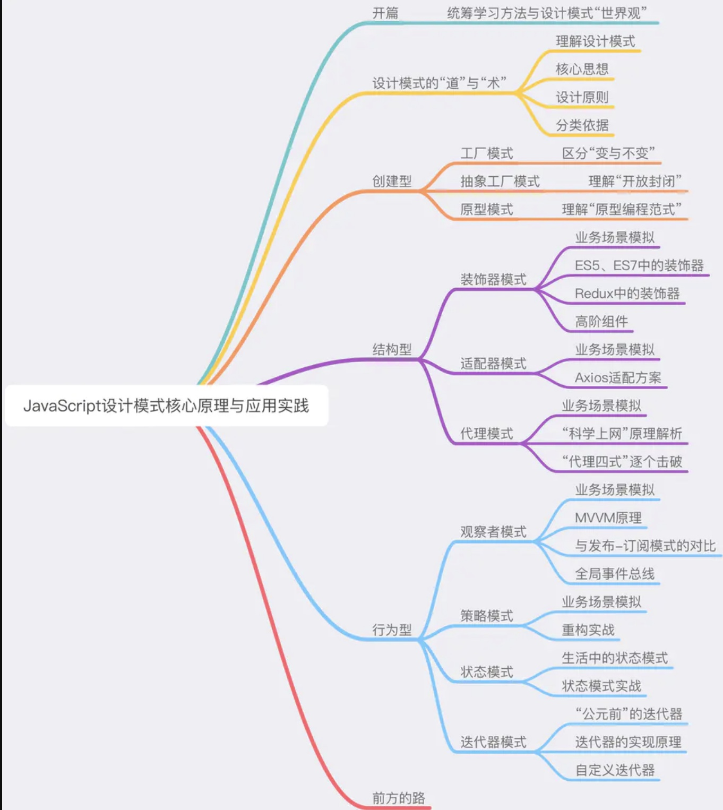
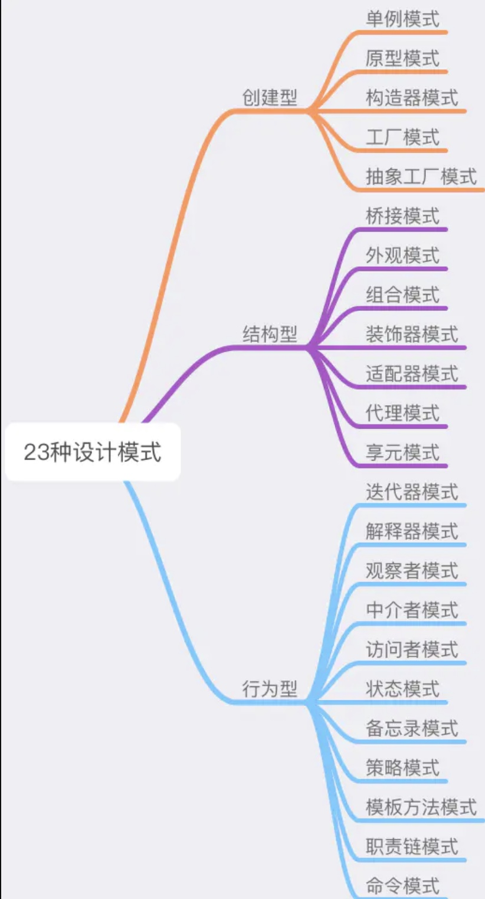

# 设计模式学习

本文是学习掘金小册《[JavaScript 设计模式核⼼原理与应⽤实践](https://juejin.cn/book/6844733790204461070)》学习总结和记录。

文章对23中设计模式，进行了取舍，保留下来的设计模式
1. 前端能用，而且好用
2. 面试会考，而且常考

## 知识体系
- 创建型
    + 工厂模式
    + 抽象工厂模式
    + 单例模式
    + 原型模式
- 结构型
    + 装饰器模式
    + 适配器模式
    + 代理模式
- 行为型
    + 观察者模式
    + 策略模式
    + 状态模式
    + 迭代器模式

引用小册中的思维导图：

23种设计模式：

## SOLID设计原则

- 单一功能原则（Single Responsibility Principle）
- 开放封闭原则（Opened Closed Principle）
- 里式替换原则（Liskov Substitution Principle）
- 接口隔离原则（Interface Segregation Principle）
- 依赖翻转原则（Dependency Inversion Principle）

在javascript中主要使用围绕**单一功能原则**和**开发封闭原则**来展开

------
原文链接：[JavaScript 设计模式核⼼原理与应⽤实践](https://juejin.cn/book/6844733790204461070)