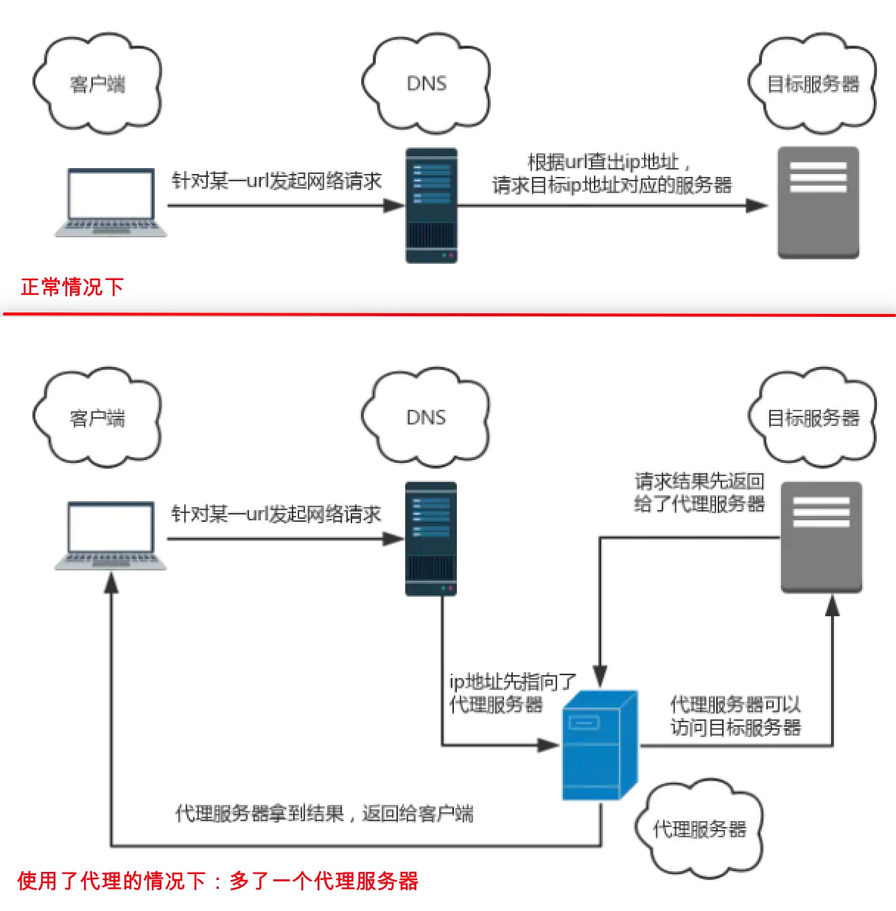

# 装饰器模式

定义：在不改变原对象的基础上，通过对其进行包装拓展，使原有对象可以满足用户的更复杂需求。

- 场景一：每个业务中的“按钮”点击后弹出“你还没登录哦”的弹框

```html
<body>
  <button id="open">打开弹唱</button>
  <button id="close">关闭弹窗</button>
</body>
<script>
  // 单例模式实现创建弹框
  const Modal = (function () {
    let modal = null;
    return function () {
      if (!modal) {
        modal = document.createElement("div");
        modal.id = "modal";
        modal.style.display = "none";
        document.body.appendChild(modal);
      }
      return modal;
    };
  })();

  // 绑定事件
  document.getElementById("open").addEventListener("click", function () {
    const modal = new Modal();
    modal.style.display = "block";
  });
  document.getElementById("close").addEventListener("click", function () {
    const modal = document.getElementById("modal");
    if (modal) {
      modal.style.display = "none";
    }
  });
</script>
```

- 场景二：弹窗后，按钮的文案修改为“快去登录”，然后把按钮置灰(按钮不仅限于一个)
  **直接修改已有的函数体这种做法，违背了开放封闭原则**
  **往一个函数体里塞这么多逻辑，违背了单一职责原则**

为了不影响已有业务，将旧逻辑与新逻辑进行拆分

```js
// 封装打开弹窗
function openModal() {
  const modal = new Modal();
  modal.style.dispaly = "block";
}
// 封装按钮文案修改
function changeButtonText() {
  const btn = document.getElementById("open");
  btn.innerText = "快去登录";
}
// 封装按钮置灰逻辑
function disableButton() {
  const btn = document.getElementById("open");
  btn.setAttribute("disabled", true);
}
// 新版本功能逻辑整合
function changeButtonStatus() {
  changeButtonText();
  disableButton();
}
document.getElementById("open").addEventListener("click", function () {
  openModal();
  changeButtonStatus();
});
```

- 使用 ES6 书写

```js
// 定义打开按钮
class OpenButton {
  // 点击后展示弹框（旧逻辑）
  onClick() {
    const modal = new Modal();
    modal.style.display = "block";
  }
}

// 定义按钮对应的装饰器
class Decorator {
  // 将按钮实例传入
  constructor(open_button) {
    this.open_button = open_button;
  }

  onClick() {
    this.open_button.onClick();
    // “包装”了一层新逻辑
    this.changeButtonStatus();
  }

  changeButtonStatus() {
    this.changeButtonText();
    this.disableButton();
  }

  disableButton() {
    const btn = document.getElementById("open");
    btn.setAttribute("disabled", true);
  }

  changeButtonText() {
    const btn = document.getElementById("open");
    btn.innerText = "快去登录";
  }
}

const openButton = new OpenButton();
const decorator = new Decorator(openButton);

document.getElementById("open").addEventListener("click", function () {
  // openButton.onClick()
  // 此处可以分别尝试两个实例的onClick方法，验证装饰器是否生效
  decorator.onClick();
});
```

- ES7 中的装饰器
  可以通过`@语法糖`轻松给一个类/类中的方法装上一个装饰器
- 装饰类

```js
// 定义装饰函数：第一个参数是目标类
function classDecorator(target) {
  target.hasDecorator = true;
  return target;
}
// 将装饰器“安装”到Button类上
@classDecorator
class Button {
  // Button类的逻辑
}
console.log(Button.hasDecorator);
```

- 装饰类中方法

```js
// 定义装饰器
/*
 * target:类的原型
 * name:修饰的目标属性的属性名
 * descriptor:属性描述对象。参考`Object.definedProperty`
 */
function funcDecorator(target, name, descriptor) {
  let originalMethod = descriptor.value;
  descriptor.value = function () {
    console.log("我是Func装饰器添加的内容");
    return originalMethod.apply(this, arguments);
  };
  return descriptor;
}
// 安装
class Button {
  @funcDecorator
  onClick() {
    console.log("我是原本的逻辑");
  }
}
// 验证
const button = new Button();
button.onClick();
```

# 适配器模式

定义：**把一个类的接口变换成客户端所期待的另一种接口，可以帮我们解决不兼容问题**
目的：抹平差异

- 生活中的适配器：type-c 手机接口和 3.5mm 耳机，需要一个额外的转接头

- 场景：李雷封装了一个基于`fetch`的 http 方法库。老板觉得 ok，让李雷把所有业务的网络请求都转移到使用这个库中。旧业务的网络请求基于`XMLHttpRequest`

此处记录只保留了部分代码，完整案例请查看原文

```js
// Ajax适配器函数，入参与旧接口保持一致
async function AjaxAdapter(type, url, data, success, failed) {
  const type = type.toUpperCase();
  let result;
  try {
    // 实际的请求全部由新接口发起
    if (type === "GET") {
      result = (await HttpUtils.get(url)) || {};
    } else if (type === "POST") {
      result = (await HttpUtils.post(url, data)) || {};
    }
    // 假设请求成功对应的状态码是1
    result.statusCode === 1 && success
      ? success(result)
      : failed(result.statusCode);
  } catch (error) {
    // 捕捉网络错误
    if (failed) {
      failed(error.statusCode);
    }
  }
}

// 用适配器适配旧的Ajax方法
async function Ajax(type, url, data, success, failed) {
  await AjaxAdapter(type, url, data, success, failed);
}
```

# 代理模式

定义：一个对象不能直接访问另一个对象，需要一个第三者（代理）牵线搭桥从而间接达到访问目的。

- 科学上网背后的代理模式
  

- ES6 中的 Proxy

```js
// 基本用法:obj-目标对象，handler-也是一个对象，定义代理行为
const proxy = new Proxy(obj, handler);
```

- 场景：实现一个"婚介所"，完整代码请查看原文

```js
// 目标对象
const girl = {
  name: "",
  age: "",
  //......
};

// 定义婚介所
const JuejinLovers = new Proxy(girl, {
  get: function (girl, key) {},
  set: function (girl, key, value) {},
});
```

- 代理模式的应用实践
  - 事件代理：高频面试题
  ```html
  <ul id="father">
    <li>1</li>
    <li>2</li>
    <li>3</li>
  </ul>
  <script>
    document.getElementById('father').addEventListener('click' , function(e){
      if(e.target.tagName = "Li"){
        // do something
      }
    })
  </script>

  ```
  - 虚拟代理
  1. 图片懒加载：先使用一个div占位，当它滚动到可视区域的时候，再即时加载真实的图片资源。
  2. 图片预加载：先用img标签占位，然后创建一个Image实例，其src属性指向真实的目标图片地址，观察Image实例加载情况，当其完成加载的时候，就将Dom上的src指向真实图片地址。

  - 缓存代理
  在一些计算量较大的场景下，我们需要**用空间换取时间**，当我们需要使用某个已经计算过的值后，不再需要二次计算

  - 保护代理
  “婚介所”场景，当需要访问目标对象中的属性时，通过`getter`和`setter`函数去进行校验和拦截。保护代理时考虑的首要方案就是ES6中的`proxy`


------
原文链接：[JavaScript 设计模式核⼼原理与应⽤实践](https://juejin.cn/book/6844733790204461070)