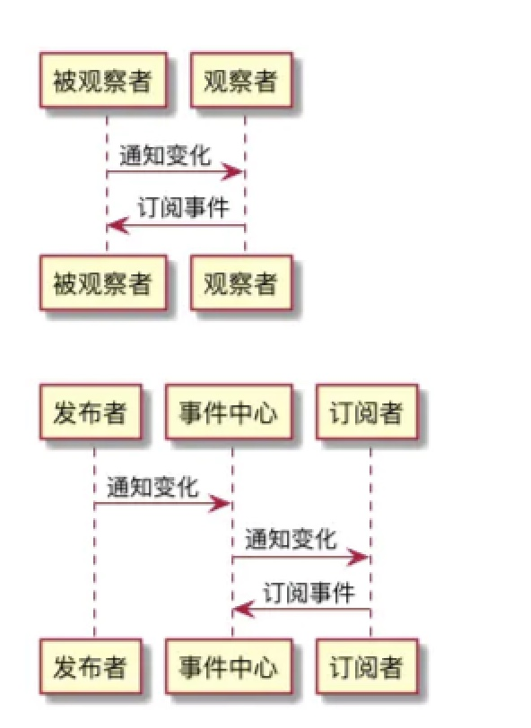

策略模式和状态模式，理解难度不大，面试中也不占什么权重，但是却对培养良好编码习惯和重构意识却大有裨益

# 策略模式

- 定义：**定义一系列的算法，把他们一个个封装起来，并且使他们互相替换**
- 场景：差异化询价：同一个商品，通过在后台给他设置不同的价格类型，可以让它展示不同的价格。
  当价格类型为“预售价”时，满 100 - 20，不满 100 打 9 折
  当价格类型为“大促价”时，满 100 - 30，不满 100 打 8 折
  当价格类型为“返场价”时，满 200 - 50，不叠加
  当价格类型为“尝鲜价”时，直接打 5 折
  ......

对四种价格做标签化：预售价-pre；大促价-onSale；返场价-back；尝鲜价-fresh；

- 资深 if-else 侠

```js
function askPrice(tag, originPrice) {
  if (tag === "pre") {
    if (originPrice >= 100) {
      return originPrice - 20;
    }
    return originPrice * 0.9;
  }
  // ......
}
```

问题一：违反了“单一功能原则”，一个 function 里面 4 坨逻辑。解决方案：**拆**
问题二：违反了“开放封闭原则”，如果需求变更，需要添加一个“新人价”，他只能继续 if-else。解决方案：**对象映射**，实现对拓展开放，对修改封闭

- 重构询价逻辑

```js
// 处理预售价
function prePrice(originPrice) {
  if (tag === "pre") {
    if (originPrice >= 100) {
      return originPrice - 20;
    }
    return originPrice * 0.9;
  }
}
// 处理大促价
function onSalePrice(originPrice) {
  // ....
}
// 处理返场价，尝鲜价.....

// 对询价分发函数，进行"开放封闭改造"
const priceProcessor = {
  pre: prePrice,
  onSale: onSalePrice,
  //......
};
function askPrice(tag, originPrice) {
  return priceProcessor[tag](originPrice);
}
```

# 状态模式

状态模式和策略模式长的很像，解决的问题本质上差别不大。

- 定义：允许一个对象在其内部状态改变时改变它的行为，对象看起来似乎修改了它的类（枯燥无味，看不懂）
  **主要解决：当控制一个对象状态的条件表达式过于复杂时的情况。把状态的胖多逻辑转移到表示不同状态的乙烯类类中，可以把复杂的判断逻辑简化**

- 场景：制作一台咖啡机

```
美式咖啡态（american)：只吐黑咖啡
普通拿铁态(latte)：黑咖啡加点奶
香草拿铁态（vanillaLatte）：黑咖啡加点奶再加香草糖浆
摩卡咖啡态(mocha)：黑咖啡加点奶再加点巧克力
```

```js
// 这里只记录了最终版本的代码，完整案例请查看原文
class CoffeeMaker {
  constructor() {
    /** 这里略去咖啡机中与咖啡状态切换无关的一些初始化逻辑 **/
    // 初始化状态，没有切换任何咖啡模式
    this.state = "init";
    // 初始化牛奶的存储量
    this.leftMilk = "500ml";
  }
  stateToProcessor = {
    that: this,
    american() {
      // 尝试在行为函数里拿到咖啡机实例的信息并输出
      console.log("咖啡机现在的牛奶存储量是:", this.that.leftMilk);
      console.log("我只吐黑咖啡");
    },
    latte() {
      this.american();
      console.log("加点奶");
    },
    vanillaLatte() {
      this.latte();
      console.log("再加香草糖浆");
    },
    mocha() {
      this.latte();
      console.log("再加巧克力");
    },
  };

  // 关注咖啡机状态切换函数
  changeState(state) {
    this.state = state;
    if (!this.stateToProcessor[state]) {
      return;
    }
    this.stateToProcessor[state]();
  }
}

const mk = new CoffeeMaker();
mk.changeState("latte");
```

- 策略模式和状态模式的的辨析
  策略模式：比如询价算法，只需要读取一个数字就能返回结果——它和计算主体是分离的，我们只需要关注计算逻辑本身就可以了。
  状态模式：比如咖啡机产品，牛奶哪里来，材料的用量等等——所以行为函数必须能很方便拿到咖啡机主体信息——**它必须得对主体有感知**

# 观察者模式

观察者模式是 Javascript 设计模式中**面试频率最高，使用频率最高的**
观察者模式有一个别名，叫“发布-订阅模式”。（但是两者之间存在差异：是否存在第三方，发布者能否直接感知订阅者）

- 定义：**定义了一种一对多的依赖关系，让多个观察者对象同时监听某一个目标对象，当这个目标对象的状态发生变化时，会通知所有观察者对象，使它们能够自动更新。**

- 场景：产品经理拉了一个群聊

- 观察者模式和发布-订阅模式的区别
  

- 生产应用案例（面试真题）

1. Vue 数据双向绑定（响应式系统）的实践原理
2. 实现一个 Event Bus/Event Emitter

# 迭代器模式

- 定义：提供一种方法顺序访问一个聚合对象中的各个元素，而又不暴露该对象的内部表示。

- 公元前的迭代器模式

1. `Array.prototype.forEach`：不支持*类数组对象*
2. 借助 jQuery 中的`each`方法

```js
const arr = [1, 2, 3];
const aNodes = document.getElementsByTagName("a");
$.each(arr, function (index, item) {
  console.log(index, item);
});

$.each(aNodes, function (index, item) {
  console.log(index, item);
});
```

- ES6 对迭代器的实现
  **ES6 约定，任何数据结构只要具备`Symbol.iterator`属性，就可以被遍历**
  准确的说，是被`for...of...`循环，和迭代器的`next`方法遍历

```js
const arr = [1, 2, 3];
for (item of arr) {
  console.log(item);
}
```

`for...of...`实际上就是借助了`Symbol.iterator`生成了对应的迭代器对象，通过反复调用对象的`next`方法

```js
const arr = [1, 2, 3];
const iterator = arr[Symbol.iterator]();
iterator.next();
iterator.next();
iterator.next();
```

- 实现一个迭代器生成的函数

```js
// ES6实现
// 编写一个迭代器生成函数
function* iteratorGenerator() {
  yield "1号选手";
  yield "2号选手";
  yield "3号选手";
}

const iterator = iteratorGenerator();

iterator.next();
iterator.next();
iterator.next();
```

```js
// ES5实现
function iteratorGenerator(list) {
  var idx = 0; // 记录当前访问的索引
  var len = list.length;
  return {
    next: function () {
      var done = idx >= len;
      var value = !done ? list[idx++] : undefined;
      return {
        done: done,
        value: value,
      };
    },
  };
}

var iterator = iteratorGenerator(["1号选手", "2号选手", "3号选手"]);
iterator.next();
iterator.next();
iterator.next();
```

---

原文链接：[JavaScript 设计模式核⼼原理与应⽤实践](https://juejin.cn/book/6844733790204461070)
